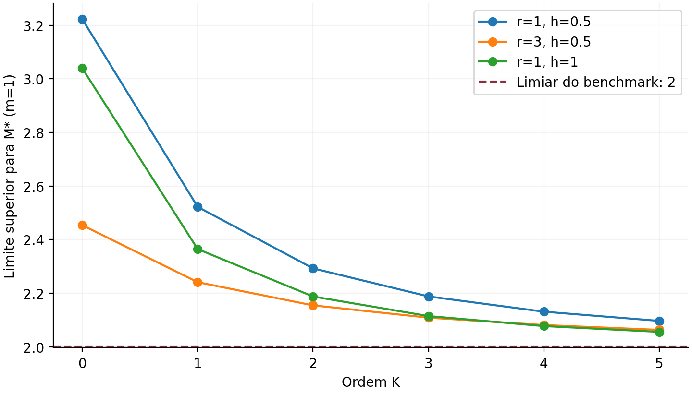
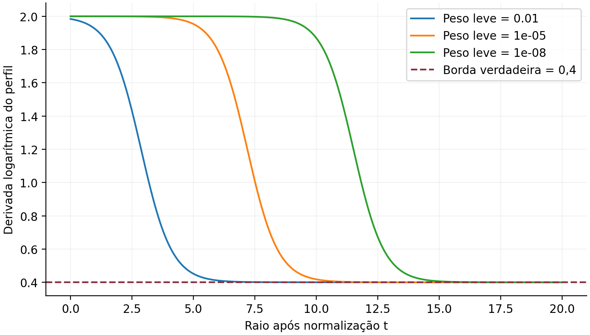

Manuscrito técnico ampliado · revisão de 11 de setembro de 2026 · demonstrações analíticas e verificações numéricas independentes

## Resumo

Uma resposta estática que admite uma representação espectral positiva transforma o perfil radial de quebra de simetria elétrica de 1-forma em uma transformada de Laplace. Demonstramos as consequências dessa hipótese, distinguindo sua validade em resposta linear da identificação adicional com um potencial entre cargas finitas. O perfil reduzido é completamente monótono; sua derivada logarítmica fornece limites superiores decrescentes para o início do suporte efetivamente acoplado. Uma hierarquia variacional usa derivadas locais, e uma segunda usa somente valores do perfil em raios equiespaçados. Esta última permite construir limites robustos a partir de intervalos de erro, sem diferenciação numérica. Uma identidade de Mellin conecta os momentos radiais aos momentos de baixa energia do correlator de corrente. Dois resultados negativos delimitam a inferência: uma componente de peso arbitrariamente pequeno impede limites inferiores uniformes com precisão finita; positividade espectral, isoladamente, não implica a conjectura da gravidade fraca. O benchmark de Dirac é calculado na ordem dominante do acoplamento, com expansão de borda até $r^{-3}$. A hipótese de gap positivo não é atribuída à QED completa, cujo correlator pode conter cortes sem massa.

Estatuto dos resultados

As proposições são deduções das hipóteses indicadas. Tabelas e gráficos são verificações computacionais em modelos especificados. Os testes usam aritmética multiprecisão, mas não aritmética intervalar; não são certificados formais de erro de quadratura. A realização das hipóteses em uma teoria interagente e a prioridade bibliográfica das aplicações são questões independentes.

## Observável, convenções e domínio de validade

### Resposta linear e carga de fluxo

Em quatro dimensões, adotamos $\hbar=c=1$, assinatura $(+,-,-,-)$ e

$$
S=\int d^4x\left[-\frac{F_{\mu\nu}F^{\mu\nu}}{4g_R^2}
+A_\mu j^\mu+\mathcal L_{\rm mat}\right].
$$

$g_R$ é fixado pelo resíduo do polo de Coulomb a longa distância. Usamos a convenção do manuscrito principal: $J_e=F/g_R^2$, $d\star J_e=0$ sem fontes elétricas. O fluxo integrado é $\star J_e$, e o operador de superfície é

$$
U_\alpha(S_r^2)=\exp\!\left(i\alpha\oint_{S_r^2}\frac{\star F}{g_R^2}\right).
$$

A derivada em $\alpha=0$ da inserção normalizada desse operador mede o valor esperado do fluxo na presença da fonte. Essa definição de carga efetiva e seu uso para caracterizar quebra generalizada seguem [R1,R2]. Para uma fonte estática de intensidade $q_W$, definimos

$$
q(r)=\frac{4\pi r^2}{g_R^2}E_r(r),\qquad
q_\infty=\lim_{r\to\infty}q(r),\qquad
\delta(r)=-\frac{r}{q_\infty}q'(r),\qquad
\Phi(r)=\frac{\delta(r)}{r^2}.
\tag{1}
$$

Trabalhamos no coeficiente de resposta linear em $q_W$, com $q_W\ne0$ antes de formar a razão. Não se pressupõe que um loop de Wilson de carga inteira finita seja determinado apenas pela função de dois pontos: cumulantes superiores podem contribuir. Identificar a resposta linear com esse potencial exige uma justificativa adicional. Uma intensidade de fonte infinitesimal é uma definição funcional da resposta, não a postulação de uma carga física fracionária na rede de cargas.

O sinal em (1) torna $\delta\ge0$ para blindagem: a carga normalizada diminui com $r$. A troca simultânea de orientação de $q$ e $q_\infty$ deixa $q'/q_\infty$ invariante e, portanto, não resolve uma divergência de sinais entre definições. Nossa convenção é explícita e a comparação com a expressão positiva de [R2, eq. (13)] é feita na ordem de uma volta. Exatamente,

$$
\delta(r)=-\frac{q(r)}{q_\infty}\frac{d\log|q(r)|}{d\log r};
$$

eliminar $q(r)/q_\infty$ só é permitido na ordem dominante em que esse fator vale $1+O(g_R^2)$.

### Hipóteses suficientes

**H1.** A resposta vem de uma QFT unitária em $3+1$ dimensões, com vácuo estável, invariância de Poincaré e simetria de rotações para a fonte pontual. Unitariedade, sozinha, não estabelece H3.

**H2.** O kernel estático possui polo de Coulomb de resíduo $g_R^2>0$. Sua parte espectral adicional é não nula e tem suporte em $[s_*,\infty)$, com $s_*>0$. Um limite inferior declarado para o suporte não é necessariamente seu ínfimo efetivo.

**H3.** O kernel de resposta linear admite a representação

$$
\mathcal G(P^2)=\frac{g_R^2}{P^2}
+\int_{s_*}^{\infty}\frac{d\sigma(s)}{P^2+s},\qquad d\sigma\ge0,
\quad P^2=|\mathbf p|^2>0.
\tag{2}
$$

Exigimos explicitamente $\int d\sigma(s)/(\mu_0^2+s)<\infty$ para uma escala de referência $\mu_0>0$. Essa condição torna a representação de Stieltjes não subtraída bem definida. Crescimento polinomial, isoladamente, não bastaria. Termos polinomiais de contato em momento são fixados à parte; sua transformada tem suporte em $r=0$.

**H4.** A medida é localmente finita e permite $\int s^k e^{-r\sqrt s}d\sigma(s)<\infty$ para todo $r>0$ e inteiro $k\ge0$. Crescimento no máximo polinomial é uma condição suficiente. As identidades são usadas em $r>0$.

**H5.** A fonte é não dinâmica e infinitamente pesada, e a relação $\widetilde\varphi(\mathbf p)=q_W\mathcal G(P^2)$ vale no regime de resposta linear adotado.

H2 é uma restrição espectral substantiva, além de H3. Não se segue apenas da expressão “fase de Coulomb”. A normalização física de $g_R$, da corrente e da fonte deve ser mantida ao comparar esquemas de renormalização. Reescalas comuns de $q$ e $q_\infty$ cancelam em (1); isso não é uma prova de invariância sob redefinições arbitrárias do observável.

## Identidade mestra e calibração perturbativa

### Transformada de Yukawa e lei de Gauss

Com um regulador de Fourier, ou no sentido de distribuições temperadas,

$$
\int\frac{d^3p}{(2\pi)^3}\frac{e^{i\mathbf p\cdot\mathbf x}}{P^2+s}
=\frac{e^{-r\sqrt s}}{4\pi r},\qquad r>0.
\tag{3}
$$

A integração angular e o resíduo em $P=i\sqrt s$ dão (3). A integral de Fourier é oscilatória: a troca de integrais não se justifica dizendo que seu integrando é positivo. Pode-se primeiro truncar a medida espectral, aplicar a transformada regulada e tomar o limite em $r>0$, controlado por H4.

Consequentemente,

$$
\varphi(r)=\frac{q_W}{4\pi r}
\left[g_R^2+\int e^{-r\sqrt s}d\sigma(s)\right],
\qquad
\frac{q(r)}{q_W}=1+\frac{1}{g_R^2}
\int(1+r\sqrt s)e^{-r\sqrt s}d\sigma(s).
\tag{4}
$$

Como $\partial_r[(1+r\sqrt s)e^{-r\sqrt s}]=-rs e^{-r\sqrt s}$, H4 permite diferenciar e H2 implica $q_\infty=q_W$. A afirmação de blindagem é $q(r)/q_\infty>1$, válida para ambos os sinais de $q_W$.

Teorema A. Representação de Laplace

Sob H1–H5,

$$
\Phi(r)=\int_{M_*}^{\infty}e^{-rx}d\nu(x),\qquad M_*=\sqrt{s_*},
\tag{5}
$$

onde a medida é definida sem pressupor densidade por

$$
\int f(x)d\nu(x)=\frac{1}{g_R^2}\int s f(\sqrt s)d\sigma(s).
\tag{6}
$$

**Prova.** Inserir a derivada de (4) em (1) dá $\delta=r^2\int se^{-r\sqrt s}d\sigma/g_R^2$. A definição (6) fornece (5). Para uma parte absolutamente contínua, $d\nu=2x^3\sigma(x^2)dx/g_R^2$. Um átomo $w\delta_{s_a}$ é levado ao átomo $(s_aw/g_R^2)\delta_{\sqrt{s_a}}$; não se deve aplicar a uma massa atômica uma fórmula de densidade sem o transporte de medida. $\square$

As dimensões são $[d\sigma]=1$, $[d\nu]=M^2$, $[\Phi]=M^2$, $[\delta]=1$ e $[\Gamma]=M$. “Exato” significa exato sob H1–H5 e no coeficiente de resposta linear. A hipótese H3 não é demonstrada para toda teoria interagente pelo cálculo de uma volta.

### Sinal da polarização do vácuo

Para a corrente de matéria não gauged, fixe

$$
i\int d^4x\,e^{ipx}\langle Tj_\mu(x)j_\nu(0)\rangle
=(p_\mu p_\nu-p^2\eta_{\mu\nu})\Pi(p^2),
$$

$$
\Pi(p^2)-\Pi(0)=p^2\int\frac{\rho_J(s)ds}{s(s-p^2-i0)},\qquad \rho_J\ge0,
$$

quando uma subtração é suficiente. Defina

$$
\overline\Pi(P^2)=-[\Pi(-P^2)-\Pi(0)]
=P^2\int\frac{\rho_J(s)ds}{s(s+P^2)}\ge0.
$$

Com essas convenções, a expansão do kernel tem os sinais

$$
\begin{aligned}
\mathcal G(P^2)&=\frac{g_R^2}{P^2[1-g_R^2\overline\Pi(P^2)]}\\
&=\frac{g_R^2}{P^2}
+g_R^4\int\frac{\rho_J(s)ds}{s(s+P^2)}+O(g_R^6).
\end{aligned}
\tag{7}
$$

A forma ressomada expressa a convenção de sinal e não prova que a aproximação seja válida a todos os momentos, particularmente perto de singularidades UV. Ela identifica $d\sigma=g_R^4\rho_J(s)ds/s+O(g_R^6)$ e fornece

$$
\Phi(r)=g_R^2\int\rho_J(s)e^{-r\sqrt s}ds+O(g_R^4).
\tag{8}
$$

A positividade do termo dominante não implica positividade termo a termo das correções perturbativas.

### Benchmark de Dirac

Para um férmion de Dirac livre de massa $m>0$, fracamente gauged,

$$
\rho_J(s)=\frac{q^2}{12\pi^2}
\left(1+\frac{2m^2}{s}\right)\sqrt{1-\frac{4m^2}{s}}
\,\Theta(s-4m^2).
\tag{9}
$$

As fórmulas de benchmark abaixo referem-se ao coeficiente dominante, com $M_*=2m$. A inserção de (9) em (8) reproduz a expressão de [R2, eq. (13)]. Para $g_R^2=4\pi\alpha$ e $q=1$, o potencial tem o prefator de Uehling $2\alpha/(3\pi)$ [R3].

**Lema 4. Teto de uma espécie na aproximação de uma volta.**

$$
0\le\delta_D(r)\le\frac{g_R^2q^2}{6\pi^2},\qquad
\Delta(mr)\equiv\frac{6\pi^2\delta_D(r)}{g_R^2q^2}\in[0,1].
\tag{10}
$$

**Prova.** Para $u=4m^2/s$, $f(u)=(1+u/2)\sqrt{1-u}$ tem $f'(u)=-3u/[4\sqrt{1-u}]\le0$, logo $0\le\rho_J\le q^2/(12\pi^2)$. Usar $\int_0^\infty e^{-r\sqrt s}ds=2/r^2$ em (8) dá o teto. Após $x=r\sqrt s$, convergência dominada dá $\Delta(0^+)=1$, e o gap implica $\Delta(\infty)=0$. $\square$

O limite $r\to0$ é um limite matemático do coeficiente de uma volta, não uma extrapolação controlada da QED completa ao UV arbitrário.

## Caracterização correta dos perfis positivos

Teorema B. Monotonicidade completa e condições da recíproca

Uma medida positiva com suporte em $[M_*,\infty)$ e transformada finita para todo $r>0$ satisfaz

$$
(-1)^n\Phi^{(n)}(r)=\int x^n e^{-rx}d\nu(x)\ge0.
\tag{11}
$$

Para um valor proposto $M_*>0$, a existência dessa medida com esse limite inferior de suporte é equivalente à monotonicidade completa de $e^{M_*r}\Phi(r)$. A equivalência é apenas para a representação de Laplace.

**Prova.** A direção direta é diferenciação dominada. Para a recíproca, Bernstein–Widder [R4] representa $e^{M_*r}\Phi(r)$ por uma medida positiva em $[0,\infty)$; transladá-la por $M_*$ produz $\nu$. A unicidade da transformada garante a unicidade da medida. $\square$

Para reconstruir o kernel de Stieltjes (2), é ainda necessário

$$
\int\frac{d\nu(x)}{x^2(\mu_0^2+x^2)}<\infty.
\tag{12}
$$

Então a medida transportada $d\sigma=g_R^2x^{-2}d\nu$, sob $s=x^2$, satisfaz H3. Para obter também H4 na forma de crescimento polinomial, essa condição de crescimento deve ser imposta à parte. Uma representação positiva do kernel tampouco constrói uma QFT local com todas as propriedades H1 e H5.

**Contraexemplo ao enunciado excessivo da recíproca.** Em unidades fixas, tome $d\nu=x^3\mathbf1_{x\ge1}dx$. Sua transformada é completamente monótona e tem gap $1$, mas (12) diverge logaritmicamente. Logo monotonicidade completa não basta para H3 na forma não subtraída. Analogamente, $\Phi(r)=1/r$ é completamente monótona e não tem gap positivo. Esses dois exemplos separam positividade, suporte e integrabilidade UV.

Blindagem, $\delta\ge0$, é uma condição ainda mais fraca. Por exemplo, $\Phi=e^{-r}-e^{-2r}/2>0$ para $r>0$, mas $\Phi''=e^{-r}-2e^{-2r}<0$ para $r<\log2$. Assim, um perfil pode ter sinal de blindagem e violar a hipótese de medida positiva.

## Extração do início do suporte

### Derivada logarítmica

Teorema C. Estimador de limiar

$$
\Gamma(r)=-\partial_r\log\Phi(r)=\frac2r-\partial_r\log\delta(r).
\tag{13}
$$

Para medida positiva não nula,

$$
\Gamma=\langle x\rangle_r\ge M_*,\qquad
\Gamma'=-\operatorname{Var}_r(x)\le0.
\tag{14}
$$

Se $M_*=\inf\operatorname{supp}\nu$, então $\Gamma(r)\downarrow M_*$.

**Prova.** A medida de probabilidade é $e^{-rx}d\nu/\Phi(r)$. Diferenciar o quociente de seus momentos fornece (14). Para a convergência, fixe $\varepsilon>0$ e $r_0>0$. O intervalo $I=[M_*,M_*+\varepsilon/4]$ tem massa $c>0$, dando $\Phi\ge ce^{-r(M_*+\varepsilon/4)}$. No numerador de $\Gamma-M_*$, a contribuição até $M_*+\varepsilon/2$ é no máximo $(\varepsilon/2)\Phi$. A cauda é limitada por $A e^{-(r-r_0)(M_*+\varepsilon/2)}$, com $A=\int(x-M_*)e^{-r_0x}d\nu<\infty$. Sua razão por $\Phi$ tende a zero como $O(e^{-r\varepsilon/4})$. Deixar $\varepsilon\to0$ conclui. $\square$

O estimador e os limites matriciais são invariantes sob $d\nu\mapsto Z d\nu$, $Z>0$. Eles medem a borda que o observável vê; um estado de resíduo nulo não é identificável. A existência matemática de um limite não fornece uma taxa uniforme de convergência sem hipóteses adicionais sobre o peso perto da borda.

### Lei de borda, polos e contínuos sobrepostos

**Teorema D.** Se a medida não tem átomo na borda e, para $t=x-M_*\downarrow0$,

$$
\frac{d\nu}{dx}=Ct^{p-1}[1+\beta t+\gamma t^2+O(t^3)],\qquad p>0,
$$

com controle exponencial da cauda, então

$$
\begin{aligned}
\Phi(r)&=C\Gamma_E(p)e^{-M_*r}r^{-p}
\left[1+\frac{\beta p}{r}+\frac{\gamma p(p+1)}{r^2}+O(r^{-3})\right],\\
\Gamma(r)&=M_*+\frac p r+\frac{\beta p}{r^2}
+\frac{2\gamma p(p+1)-\beta^2p^2}{r^3}+O(r^{-4}).
\end{aligned}
\tag{15}
$$

**Prova.** Aplicar o lema de Watson [R5] separadamente a $\Phi$ e a $\int t e^{-rx}d\nu$, e usar $\Gamma-M_*=(\int t e^{-rx}d\nu)/\Phi$. Esse numerador subtrai exatamente $M_*\Phi$ antes da expansão. A identidade $\int_0^\infty t^{p+j-1}e^{-rt}dt=\Gamma_E(p+j)r^{-p-j}$ e a divisão das séries dão (15). Não se diferencia uma notação de resto. $\square$

Se apenas $1+O(t)$ é conhecido, só se conclui $\Gamma=M_*+p/r+O(r^{-2})$. Para um átomo $Z\delta_{M_*}$ **separado** do restante do suporte por $d>0$, a convergência é $\Gamma-M_*=O(e^{-dr})$. A separação é uma hipótese, não uma consequência de haver átomo.

Se um átomo e um contínuo começam na mesma borda,

$$
d\nu=Z\delta_{M_*}+Ct^{p-1}[1+O(t)]dt,
$$

então

$$
\Gamma(r)-M_*\sim\frac{C\Gamma_E(p+1)}Z\,r^{-p-1}.
\tag{16}
$$

A convergência é algébrica, apesar do polo. A distinção entre (15), (16) e um polo isolado evita classificar incorretamente um contínuo que toca um estado discreto.

Para Dirac,

$$
\frac{d\nu}{dx}=\frac{g_R^2q^2\sqrt m}{2\pi^2}\sqrt t
\left[1-\frac{5t}{24m}+\frac{77t^2}{384m^2}+O(t^3/m^3)\right],
$$

e portanto

$$
\boxed{\Gamma_D(r)=2m+\frac{3}{2r}-\frac{5}{16mr^2}
+\frac{45}{32m^2r^3}+O(m^{-3}r^{-4}).}
\tag{17}
$$

A análise da potência de borda também distingue canais parciais: $p=3/2$ neste canal de Dirac não é universal para todo limiar de dois corpos. Fatores de momento no elemento de matriz alteram a potência de abertura. Não se deduz spin exclusivamente de um expoente sem especificar o operador e os números quânticos do canal.

## Hierarquia local e prova de convergência

Defina $a_n(r)=\int x^ne^{-rx}d\nu$ e

$$
(H_0)_{ij}=a_{i+j},\qquad(H_1)_{ij}=a_{i+j+1},\quad0\le i,j\le K.
$$

**Teorema E.** Quando $H_0\succ0$,

$$
M_*\le B_K(r)=\lambda_{\min}(H_1,H_0),\qquad
B_{K+1}\le B_K,\quad B_0=\Gamma(r).
\tag{18}
$$

**Prova do limite.** Para $p_v(x)=\sum v_ix^i$,

$$
v^T(H_1-M_*H_0)v=\int(x-M_*)p_v(x)^2e^{-rx}d\nu\ge0.
$$

A inclusão de espaços polinomiais prova a monotonicidade em $K$. $H_0$ é positiva definida se o suporte possui ao menos $K+1$ pontos distintos. Para suporte finito, trabalha-se no quociente pelo núcleo: uma medida de $L$ átomos é resolvida em ordem $L-1$ e ordens posteriores são singulares, não novos feixes positivos definidos.

**Prova da convergência.** Fixe $r>0$ e $0<t<r$. A medida finita $d\mu_r=e^{-rx}d\nu$ satisfaz

$$
a_{2n}(r)\le(2n)!\,t^{-2n}\Phi(r-t),\qquad
\sum_{n\ge1}a_{2n}(r)^{-1/(2n)}=\infty.
\tag{19}
$$

O limite vem de $e^{tx}\ge(tx)^{2n}/(2n)!$ e dá a condição de Carleman com os momentos pares corretos. Para controlar diretamente o quociente de Rayleigh, considere também $d\omega=(1+x)e^{-rx}d\nu$. Essa medida possui um momento exponencial positivo. Polinômios são densos em $L^2(\omega)$: se $f$ fosse ortogonal a todos eles, Cauchy–Schwarz tornaria $\int f(x)e^{zx}d\omega$ analítica numa faixa ao redor do eixo imaginário, com todas as derivadas em zero nulas; unicidade analítica e da transformada de Fourier implicaria $f=0$.

Aproxime em $L^2(\omega)$ a função indicadora de $[M_*,M_*+\varepsilon]$, que tem massa positiva quando $M_*\in\operatorname{supp}\nu$. Essa norma controla tanto $\int p^2d\mu_r$ quanto $\int xp^2d\mu_r$. O quociente dos polinômios aproximantes tende ao quociente da indicadora, no máximo $M_*+\varepsilon$. Logo $\lim B_K\le M_*+\varepsilon$; como $B_K\ge M_*$, a conclusão segue. $\square$

A hierarquia usa momentos de ordem $0$ até $2K+1$: são $2K+2$ valores, incluindo a função e suas derivadas até ordem $2K+1$. Nos momentos de Stieltjes do manuscrito principal, as potências são negativas e o feixe correto é invertido: $s_0\le\lambda_{\min}(H_0,H_1)$. As duas implementações não são intercambiáveis.

## Limites a partir de amostras, sem derivadas

### Dois raios

Para $h>0$, defina

$$
G_h(r)=-\frac1h\log\frac{\Phi(r+h)}{\Phi(r)}
=-\frac1h\log\frac{\delta(r+h)r^2}{\delta(r)(r+h)^2}.
\tag{20}
$$

**Teorema F.** Para uma medida positiva não nula,

$$
M_*\le\Gamma(r+h)\le G_h(r)\le\Gamma(r),\qquad
\partial_rG_h(r)\le0.
\tag{21}
$$

**Prova.** $G_h(r)=h^{-1}\int_r^{r+h}\Gamma(u)du$ e $\Gamma$ é não crescente. Assim $G_h$ também converge à borda efetiva quando $r\to\infty$ a $h$ fixo. $\square$

Se intervalos simultâneos $0<\ell_j\le\Phi(r+jh)\le u_j$ são conhecidos para $j=0,1$, obtém-se o limite robusto

$$
M_*\le\frac1h\log\frac{u_0}{\ell_1}.
\tag{22}
$$

O denominador inferior estritamente positivo é indispensável. Um valor robusto incompatível com $M_*\ge0$ sinaliza incompatibilidade dos dados ou hipóteses; não deve ser corrigido silenciosamente por truncamento.

### Hierarquia de amostragem

Ponha $b_j=\Phi(r+jh)/\Phi(r)$ e transporte a medida de probabilidade por $y=e^{-hx}$. Ela tem suporte em $[0,L_*]$, com $L_*=e^{-hM_*}$ quando $M_*$ é a borda efetiva. Então $b_j=\int y^j d\omega_{r,h}(y)$ são momentos de Hausdorff e

$$
(C_0)_{ij}=b_{i+j},\qquad(C_1)_{ij}=b_{i+j+1}.
$$

Teorema G. Hierarquia sem diferenciação

$$
L_K=\lambda_{\max}(C_1,C_0)\le L_*,\qquad
M_*\le\mathcal B_K(r,h)=-h^{-1}\log L_K.
\tag{23}
$$

Enquanto o feixe for não singular, $L_{K+1}\ge L_K$ e $\mathcal B_{K+1}\le\mathcal B_K$, com $\mathcal B_0=G_h$. Para suporte infinito, $L_K\uparrow L_*$ e $\mathcal B_K\downarrow M_*$.

**Prova.** O quociente $\int yp(y)^2d\omega/\int p(y)^2d\omega$ é no máximo $L_*$. Ampliar o espaço polinomial aumenta seu supremo. Polinômios são densos para uma medida finita em intervalo compacto; aproximar uma função concentrada numa vizinhança de $L_*$ faz o quociente aproximar $L_*$. No caso de $L$ átomos, interpolação polinomial isola cada átomo em grau $L-1$, dando recuperação exata e exigindo redução de posto depois disso. $\square$

São necessários $2K+2$ valores entre $r$ e $r+(2K+1)h$. Essa hierarquia troca derivadas por uma janela radial finita. Não há ordenação universal aqui demonstrada entre $B_K(r)$ e $\mathcal B_K(r,h)$ para a mesma ordem: elas consomem informações diferentes. $h$ pequeno pode causar quase dependência linear; $h$ grande reduz a amplitude das amostras tardias. Melhor limite nominal não garante menor erro total.

### Propagação determinística de erros matriciais

Use amostras **não normalizadas** $\widehat b_j\approx\Phi(r+jh)$, com limites simultâneos $|\widehat b_j-b_j^{\rm true}|\le\varepsilon_j$. A normalização não muda o feixe exato, mas introduzir uma razão ruidosa exigiria propagar sua incerteza. Para qualquer vetor real $v\ne0$, defina

$$
E_a(v)=\sum_{i,j=0}^K|v_iv_j|\varepsilon_{i+j+a},\quad a=0,1,
$$

$$
\ell(v)=\frac{v^T\widehat C_1v-E_1(v)}{v^T\widehat C_0v+E_0(v)}.
\tag{24}
$$

Se numerador e denominador de (24) são positivos e $v^TC_0^{\rm true}v>0$, então

$$
M_*\le-h^{-1}\log\ell(v).
\tag{25}
$$

**Prova.** Os limites por entrada dão $N_{\rm true}\ge N_{\rm obs}-E_1>0$ e $D_{\rm true}\le D_{\rm obs}+E_0$, de modo que $\ell(v)\le N_{\rm true}/D_{\rm true}\le L_*$. O logaritmo inverte a ordem após multiplicar por $-1/h$. A positividade do numerador já exclui um vetor no núcleo da matriz de momentos verdadeira para dados compatíveis. $\square$

O vetor pode ser escolhido usando os próprios dados, pois o limite é uniforme em $v$ no evento de erro simultâneo. Se os intervalos forem probabilísticos, a cobertura deve ser conjunta sobre todas as amostras e todas as escolhas de $r,h,K$ examinadas. Usar intervalos marginais de 95% e depois escolher o melhor resultado não garante cobertura de 95%. Se nenhum vetor produz numerador positivo, este procedimento não fornece limite finito; isso não prova que nenhum outro método possa fazê-lo.

## Ponte exata entre momentos radiais e momentos de baixa energia

Na ordem dominante de (8), sejam $c_n=\int\rho_J(s)s^{-n-1}ds$, $n\ge1$, quando finitos. Então

$$
\boxed{c_n=\frac{1}{g_R^2\Gamma_E(2n+2)}
\int_0^\infty r^{2n-1}\delta_D(r)dr.}
\tag{26}
$$

**Prova.** Inserir $\delta_D=g_R^2r^2\int\rho_J(s)e^{-r\sqrt s}ds$, trocar integrais não negativas por Tonelli e usar $\int_0^\infty r^{2n+1}e^{-r\sqrt s}dr=\Gamma_E(2n+2)s^{-n-1}$. A finitude de $c_n$ garante a finitude de ambos os lados. $\square$

A versão não perturbativa para a medida de (2) é

$$
\int_0^\infty r^{2n-1}\delta(r)dr
=\frac{\Gamma_E(2n+2)}{g_R^2}\int s^{-n}d\sigma(s).
\tag{27}
$$

Não se identifica o último integral com o correlator de matéria desacoplada além da ordem em que (8) foi demonstrada. A dimensão de (26) é $M^{-2n}$ nos dois lados. A identidade une os dois manuscritos por uma operação calculável: os momentos de baixa energia são integrais ponderadas do perfil de quebra, enquanto (23) usa dados radiais locais em uma janela.

## Limite fundamental da inferência com precisão finita

**Teorema H. Ausência de limite inferior uniforme sem peso mínimo.** Fixe $M>\mu\ge0$, uma janela $0\le t\le T$ e $0<\epsilon<1$. Os perfis normalizados

$$
f_0(t)=e^{-Mt},\qquad
f_\epsilon(t)=(1-\epsilon)e^{-Mt}+\epsilon e^{-\mu t}
\tag{28}
$$

têm bordas $M$ e $\mu$, mas

$$
\sup_{0\le t\le T}|f_\epsilon-f_0|\le\epsilon,
\qquad
\sup_{0\le t\le T}\frac{|f_\epsilon-f_0|}{f_0}
=\epsilon\left(e^{(M-\mu)T}-1\right).
\tag{29}
$$

**Prova.** Subtrair os dois perfis dá $\epsilon(e^{-\mu t}-e^{-Mt})$; sua magnitude é no máximo $\epsilon$ e a razão por $f_0$ cresce com $t$. Os perfis são transformadas de medidas positivas com um e dois átomos. Para qualquer tolerância positiva na janela, escolher $\epsilon$ suficientemente pequeno torna as duas hipóteses indistinguíveis dentro dessa tolerância. $\square$

O tempo radial em que as duas componentes se igualam é

$$
t_\times=\frac{\log[(1-\epsilon)/\epsilon]}{M-\mu},\qquad \epsilon<1/2.
\tag{30}
$$

Assim, limites superiores robustos são possíveis, mas não se pode anunciar a localização bilateral de toda a borda com uma janela finita sem peso mínimo, modelo espectral ou informação externa. Isso não contradiz a unicidade da transformada conhecida exatamente em todo um intervalo aberto: essa unicidade é uma afirmação ideal sem erro observacional.

## Alcance físico: QED completa e gravidade

### O primeiro limiar do observável pode não ser carregado

Na QED completa, a polarização do vácuo possui contribuição de estados intermediários de três fótons cujo corte começa em $s=0$, aparecendo a ordem $\alpha^4$ na polarização perturbativa [R6, nota 1]. Portanto H2 com $s_*>0$ não pode ser deduzida simplesmente da massa do elétron. O benchmark (9) descreve o setor de matéria livre na ordem dominante do gauging. Um correlator completo, uma contribuição perturbativa selecionada e um observável com estados finais etiquetados são objetos diferentes.

Uma componente sem gap, por menor que seja seu coeficiente, pode dominar o limite estrito $r\to\infty$ sobre uma contribuição $e^{-2mr}$. O Teorema C retorna o ínfimo do suporte efetivamente acoplado; se esse ínfimo for zero, o limite será zero. Remover um corte requer definir e justificar a medida remanescente e sua positividade. Subtrair funções positivas arbitrariamente não preserva positividade.

Em dimensão espacial $d\ne3$, o kernel é

$$
\int\frac{d^dp}{(2\pi)^d}\frac{e^{i\mathbf p\cdot\mathbf x}}{p^2+x^2}
=\frac{x^{d/2-1}}{(2\pi)^{d/2}r^{d/2-1}}K_{d/2-1}(xr).
\tag{31}
$$

A forma de Laplace simples em (5) usa especialmente $K_{1/2}$. Não se transportam os teoremas para toda dimensão substituindo apenas $r^2$ por $r^{D-2}$. Fase de Higgs, confinamento e kernels antiblindantes também exigem outra formulação.

### Consequência gravitacional estritamente condicional

A reescala $d\nu\mapsto Zd\nu$ preserva $\Gamma$, $B_K$ e $\mathcal B_K$. Logo a geometria normalizada não fixa $g|q|M_{\rm Pl}/m$. Isso recupera o no-go do manuscrito principal sem afirmar que a WGC seja falsa.

Uma implicação com informação adicional pode ser formulada precisamente. Seja $I_\Lambda$ um conjunto finito de $N$ espécies de Dirac com $0<m_i\le\Lambda$. Suponha, independentemente,

$$
\delta_{\rm obs}(1/\Lambda)\ge\eta,\qquad
\delta_{\rm obs}(1/\Lambda)\le
\frac{g_R^2}{6\pi^2}\sum_{i\in I_\Lambda}q_i^2\Delta(m_i/\Lambda)+\tau+\varepsilon,
$$

$$
N\Lambda^2\le\kappa M_{\rm Pl}^2,\qquad
\tau,\varepsilon\ge0,\quad \eta>\tau+\varepsilon.
\tag{32}
$$

$\tau$ limita a cauda de espécies pesadas; $\varepsilon$ limita conjuntamente erros de modelagem e de aproximação. $\eta$ e $\kappa$ são definidos antes da inferência. Sob essas hipóteses,

$$
\max_{i\in I_\Lambda}\frac{g_R|q_i|M_{\rm Pl}}{m_i}
\ge\sqrt{\frac{6\pi^2(\eta-\tau-\varepsilon)}{\kappa}}.
\tag{33}
$$

**Prova.** Escreva $z=\max_i g_R|q_i|M_{\rm Pl}/m_i$. Pelo teto (10),

$$
\eta-\tau-\varepsilon
\le\frac{z^2}{6\pi^2M_{\rm Pl}^2}\sum_i m_i^2
\le\frac{z^2N\Lambda^2}{6\pi^2M_{\rm Pl}^2}
\le\frac{z^2\kappa}{6\pi^2}.
$$

Rearranjar dá (33). $\square$

O conteúdo físico está nas hipóteses (32). Um perfil de quebra de ordem um pode comprometer a própria expansão perturbativa; $\varepsilon$ não pode ser descartado por conveniência. Supressão exponencial de uma espécie pesada não controla uma torre com degenerescências e cargas não limitadas. A condição de espécies é gravitacional e independente da positividade. Assim (33) é uma implicação condicional demonstrada, não uma prova da WGC na QED ou em toda gravidade quântica.

## Resultados reproduzíveis e critérios de falsificação

As tabelas abaixo são geradas pelos scripts do pacote, com $m=q=g_R^2=1$. Essa escolha normaliza o coeficiente perturbativo; não declara pequeno um acoplamento fisicamente igual a um. A revisão numérica extrai $e^{-2mr}$ antes da quadratura e usa $y=\sqrt{r(x-2m)}$, evitando que a integral minúscula em raios grandes satisfaça uma tolerância absoluta sem precisão relativa adequada.



{fig-alt="Limites superiores para o limiar de Dirac diminuem com a ordem da hierarquia de amostragem." width=88%}

{fig-alt="Derivada logarítmica de uma mistura de dois polos migra da massa maior à menor em raios tardios." width=88%}

Uma violação significativa de monotonicidade completa ou das matrizes de momentos rejeita a hipótese espectral para aquele observável, após contabilizar erros. Aprovação de uma quantidade finita de testes não prova a hierarquia infinita. A comparação de precisões e de variáveis de integração testa estabilidade numérica; a classificação como resultado exato depende das demonstrações, não do número de casas decimais.

## Contribuição e trabalho que permanece aberto

Os ingredientes de análise usados aqui são clássicos: Bernstein–Widder, Watson, Rayleigh–Ritz e momentos de Hausdorff. A contribuição apresentada é sua organização para um observável radial de quebra, com sinais consistentes, hipóteses de suporte explícitas, ponte de Mellin e limites operacionais com erro. Não se reivindica prioridade sobre esses teoremas matemáticos nem se considera uma busca dirigida prova de originalidade.

Permanecem questões físicas concretas: estabelecer H3 para um kernel interagente além da ordem dominante; construir uma etiqueta positiva que separe canais carregados dos cortes sem massa; obter um orçamento de erro para forte quebra; e controlar caudas espectrais em exemplos gravitacionais. A hierarquia amostrada oferece uma forma de testar esses programas sem começar por derivadas de ordem alta. O resultado entregue é uma inferência condicional reproduzível, com limites superiores e contraexemplos explícitos ao que os dados não permitem concluir.

## Referências

[R1] C. Córdova, K. Ohmori e T. Rudelius. “Generalized Symmetry Breaking Scales and Weak Gravity Conjectures”. JHEP 11 (2022) 154. [arXiv:2202.05866](https://arxiv.org/abs/2202.05866).

[R2] I. Basile e P. Golmohammadi. “Center Symmetry Breaking in Calabi–Yau Compactifications”. Symmetry 17 (2025) 490. [Texto primário, eq. (13)](https://arxiv.org/html/2503.19628v1).

[R3] E. A. Uehling. “Polarization Effects in the Positron Theory”. Physical Review 48 (1935) 55. [DOI](https://doi.org/10.1103/PhysRev.48.55).

[R4] D. V. Widder. The Laplace Transform. Princeton University Press (1941), Cap. IV. Para distinções entre funções completamente monótonas e funções de Stieltjes: R. L. Schilling, R. Song e Z. Vondraček, Bernstein Functions: Theory and Applications, [página dos autores e erratas](https://www.motapa.de/bernstein_functions/).

[R5] NIST Digital Library of Mathematical Functions, [§2.3(ii), lema de Watson](https://dlmf.nist.gov/2.3#ii). As fórmulas de (15) são derivadas no texto aplicando o lema a numerador e denominador separadamente.

[R6] M. Beneke e P. Ruiz-Femenía. “Threshold singularities, dispersion relations and fixed-order perturbative calculations”. JHEP 08 (2016) 145. [arXiv:1606.02434, nota 1](https://arxiv.org/pdf/1606.02434).

[R7] D. Gaiotto, A. Kapustin, N. Seiberg e B. Willett. “Generalized Global Symmetries”. JHEP 02 (2015) 172. [arXiv:1412.5148](https://arxiv.org/abs/1412.5148).
