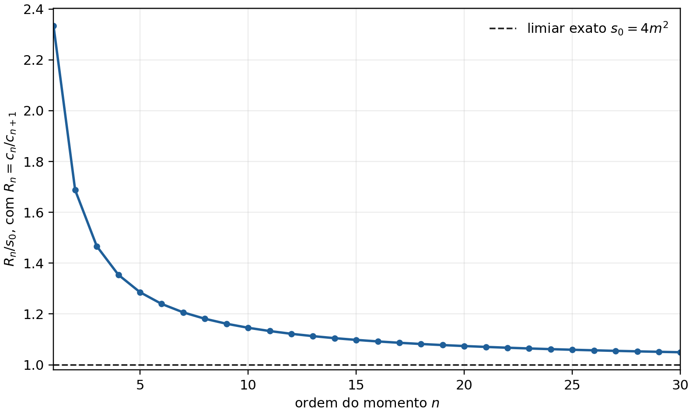
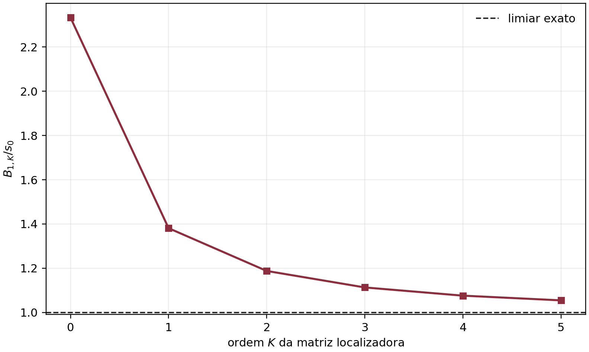

<p class="meta-line">Revisão matemática ampliada em 11 de setembro de 2026 · física matemática e teoria quântica de campos · levantamento bibliográfico original de 10 de setembro de 2026</p>

<div class="leadbox">
<div class="box-title">Legenda epistemológica obrigatória</div>
<p><span class="tag t">T</span><strong>Teorema/resultado dedutivo:</strong> consequência demonstrada das hipóteses declaradas. <span class="tag e">E</span><strong>Resultado empírico ou computacional:</strong> observação numérica reproduzível ou fato experimental documentado. <span class="tag c">C</span><strong>Conjectura:</strong> proposição falsificável ainda não demonstrada. <span class="tag h">H</span><strong>Heurística:</strong> interpretação útil, sem força de prova. <span class="tag o">O</span><strong>Opinião:</strong> juízo editorial ou de prioridade. Definições, convenções e perguntas não são afirmações e, por isso, não recebem classe própria.</p>
</div>

## Resumo

<p><span class="tag t">T</span>Se uma simetria compacta atua unitariamente no espaço de Hilbert assintótico e o operador de espalhamento preserva exatamente seus setores, a transformada de Fourier do defeito topológico é um projetor ortogonal $P_q$, e a descontinuidade forward com inserção de $P_q$ é uma soma de quadrados não negativa. Quando a simetria é quebrada, a identidade exata contém o termo $-\langle S^\dagger P_qS-P_q\rangle$, que não possui sinal definido; portanto, unitariedade não implica positividade setor a setor para um defeito não topológico. Essa obstrução é exibida por um contraexemplo unitário de dimensão dois.</p>

<p><span class="tag t">T</span>Para qualquer densidade espectral positiva com suporte em $[s_0,\infty)$, os momentos de Stieltjes $c_n=\int_{s_0}^{\infty}\rho(s)s^{-n-1}ds$ obedecem $s_0\le c_n/c_{n+1}$, às desigualdades de Hankel e ao limite mais forte $s_0\le\lambda_{\min}(H_0,H_1)$. Entretanto, os mesmos momentos agregados não identificam a decomposição em setores e, mesmo quando um setor positivo é dado por hipótese, a positividade é homogênea no peso espectral e não limita $m/(g|q|M_{\rm Pl})$. Uma medida delta positiva constitui um contraexemplo universal; logo, positividade espectral isolada não demonstra a Weak Gravity Conjecture (WGC).</p>

<p><span class="tag e">E</span>Como controle positivo, a representação de Källén–Lehmann do correlator de uma corrente vetorial conservada é avaliada exatamente para um férmion de Dirac: o limiar físico é $s_0=4m^2$, e $c_n/c_{n+1}=4m^2(n+1)(2n+5)/[2n(n+2)]\to4m^2$. Um cálculo reproduzível mostra que a hierarquia matricial reduz o excesso do limite sobre $s_0$ de $133{,}3\%$ em ordem $K=0$ para $5{,}46\%$ em $K=5$. Uma simulação de $10^5$ réplicas quantifica viés, cobertura e poder sob erros correlacionados de $0{,}5\%$.</p>

<p><span class="tag c">C</span>Um caminho possível para obter informação de gravidade quântica é combinar observáveis espectralmente etiquetados, um controle quantitativo da quebra da simetria e amplitudes infrared-safe não forward com hipóteses independentes de completude ou extremalidade. O trabalho formula os testes que separariam essa conjectura de seus concorrentes e entrega um protocolo de reprodutibilidade integral.</p>

<p class="keywords"><strong>Palavras-chave:</strong> positivity bounds; generalized global symmetries; one-form symmetry; moment problem; Källén–Lehmann representation; Weak Gravity Conjecture; infrared-safe amplitudes; quantum gravity.</p>

## Introdução

<p><span class="tag t">T</span>Analiticidade, unitariedade, crossing e crescimento assintótico controlado convertem amplitudes em relações de dispersão cujas partes absortivas são positivas em canais físicos. Em teorias sem forças de longo alcance, essa cadeia produz restrições de sinal e hierarquias de momentos para coeficientes de uma effective field theory (EFT); a positividade, porém, é sempre condicional à escolha do observável, ao número de subtrações, ao domínio de analiticidade e à separação entre contribuições IR e UV [1–4].</p>

<p><span class="tag c">C</span>A WGC afirma, em sua forma elétrica simples para um $U(1)$ quadridimensional, que existe ao menos um estado carregado cuja razão carga/massa é superextremal, esquematicamente $m\lesssim g|q|M_{\rm Pl}$, com o fator de ordem um dependente das convenções e do conteúdo de campos [5]. A conjectura é motivada por decaimento de buracos negros extremiais, ausência de remanescentes e exemplos de teoria de cordas; esses argumentos não equivalem a uma dedução a partir de unitariedade da matriz $S$.</p>

<p><span class="tag h">H</span>A linguagem de simetrias generalizadas torna atraente relacionar a massa de estados carregados à escala em que a simetria elétrica de 1-forma de Maxwell deixa de ser uma descrição aproximada. Essa conexão requer um critério quantitativo de “quebra forte” abaixo da escala de Planck e foi apresentada precisamente como hipótese capaz de motivar a WGC, não como teorema de positividade [6–9].</p>

<p><span class="tag o">O</span>A lacuna metodológica central é que três operações frequentemente são condensadas em uma única seta lógica: inserir um defeito, projetar por Fourier e interpretar o primeiro limiar projetado como a massa do estado de carga $q$. Cada operação possui hipóteses independentes. Um artigo publicável deve provar as setas válidas, isolar as inválidas e declarar qual informação adicional seria suficiente para restaurá-las.</p>

### Objetivo e contribuições

<p><span class="tag t">T</span>Este trabalho resolve a parte matemática do problema por cinco resultados: (i) um teorema condicional de positividade para projetores de setores exatamente conservados; (ii) uma identidade de obstrução quando o setor não é conservado; (iii) uma hierarquia de limites de gap por matrizes localizadoras; (iv) um teorema de não identificabilidade setorial a partir de momentos agregados; e (v) um no-go que impede derivar a WGC somente do cone de medidas positivas.</p>

<p><span class="tag e">E</span>O controle de sanidade é um benchmark de uma volta para a polarização do vácuo de um férmion de Dirac, no qual a densidade espectral, todos os momentos relevantes, a convergência ao limiar e a incerteza do estimador são calculáveis. Os resultados numéricos, tabelas e figuras são regenerados por um script determinístico incluído no pacote.</p>

<p><span class="tag c">C</span>O programa físico que sobrevive à auditoria substitui “coeficientes de Wilson agregados determinam espectros de carga” por “uma família de observáveis positivamente etiquetados, com erro de vazamento setorial limitado, pode limitar limiares carregados”. Essa formulação possui um critério de falha mensurável e não pressupõe a conclusão da WGC.</p>

### Relação com a literatura e novidade delimitada

<p><span class="tag t">T</span>A teoria de simetrias generalizadas fornece defeitos topológicos e regras de seleção quando a simetria é exata [7]. A literatura de positive moments caracteriza o cone de momentos e suas matrizes de Hankel [2,3]. Trabalhos sobre positividade gravitacional mostram que o polo $t$-channel do gráviton e a física de Regge modificam os limites forward usuais [10,11], enquanto uma construção recente define amplitudes stripped dependentes da resolução experimental e funcionais não forward infrared-safe [12].</p>

<p><span class="tag t">T</span>A insuficiência genérica de positivity bounds para provar a WGC além de setores especiais já foi demonstrada em EFTs com dilaton e axion, nas quais dualidade ou supersimetria fornecem informação UV adicional [13]. O no-go aqui é distinto: ele opera no nível abstrato do problema de momentos e mostra que nenhuma coleção de desigualdades que dependa apenas da positividade e seja invariável por reescala do peso espectral pode impor uma razão envolvendo $g|q|M_{\rm Pl}$.</p>

<p><span class="tag o">O</span>A combinação da identidade de não conservação do projetor, do teorema de não identificabilidade e do contraexemplo de medida delta constitui a contribuição conceitual original mais defensável. A afirmação de prioridade é de confiança moderada, pois uma busca por títulos, resumos e textos primários até 10 de setembro de 2026 não pode excluir equivalências formuladas em notação diferente.</p>

## Formulação, hipóteses e análise dimensional

### Convenções

<p><span class="tag t">T</span>Adotam-se $\hbar=c=1$, assinatura $\eta_{\mu\nu}=\mathrm{diag}(+,-,-,-)$ e massa de Planck reduzida definida por $S_{\rm EH}=\int d^4x\sqrt{-g}\,M_{\rm Pl}^2R/2$, de modo que $M_{\rm Pl}^{-2}=8\pi G_N$. Para Maxwell,</p>

$$
S=\int d^4x\sqrt{-g}\left[\frac{M_{\rm Pl}^2}{2}R-\frac{1}{4g^2}F_{\mu\nu}F^{\mu\nu}+A_\mu j^\mu+\mathcal L_{\rm matter}\right].
$$

<p><span class="tag t">T</span>Nessa normalização, $g$ e a carga inteira $q$ são adimensionais em quatro dimensões; $m$, $\sqrt{s}$ e $M_{\rm Pl}$ têm dimensão de massa. Logo, $m/(g|q|M_{\rm Pl})$ é adimensional, enquanto $c_n/c_{n+1}$ possui dimensão de massa ao quadrado.</p>

<p><span class="tag t">T</span>Usando a convenção de corrente de $(p+1)$-forma $J$ com equação de conservação $d{\star J}=0$, a teoria de Maxwell sem cargas elétricas admite $J_e^{(2)}=F/g^2$, pois $d{\star F}/g^2=0$. Matéria eletricamente carregada modifica a equação para $d{\star F}/g^2={\star j}$ e quebra a simetria elétrica de 1-forma. Analogamente, monopolos quebram a simetria magnética associada à identidade de Bianchi $dF=0$.</p>

<p><span class="tag t">T</span>Simetrias elétrica e magnética não podem, em geral, ser tratadas como dois projetores locais simultaneamente independentes: operadores de linha elétricos e magnéticos possuem emparelhamento de Dirac e não localidade mútua. Uma resolução conjunta $(q_e,q_m)$ exige compatibilidade global, escolha da rede de linhas genuínas e tratamento da possível anomalia mista; sem esses dados, a projeção dupla é apenas notação formal [7,9].</p>

### Espaço de Hilbert, amplitudes e observável setorial

<p><span class="tag t">T</span>Seja $\mathcal H$ o espaço de Hilbert assintótico, $S=\mathbf 1+iT$ um operador unitário e $U(\alpha)$, $\alpha\in[0,2\pi)$, uma representação unitária fortemente contínua de $U(1)$. Para espectro inteiro de cargas, define-se</p>

$$
P_q\equiv\int_0^{2\pi}\frac{d\alpha}{2\pi}\,e^{-iq\alpha}U(\alpha),\qquad q\in\mathbb Z.
$$

<p><span class="tag t">T</span>As relações de representação implicam $P_q^\dagger=P_q$, $P_qP_{q'}=\delta_{qq'}P_q$ e $\sum_qP_q=\mathbf 1$ no sentido forte no subespaço gerado pela representação. O símbolo “amplitude resolvida por simetria” será reservado a uma quantidade em que esse projetor atua no mesmo espaço assintótico sobre o qual $S$ é unitário.</p>

<p><span class="tag h">H</span>Um defeito topológico de 1-forma envolvendo uma linha carregada pode realizar $U(\alpha)$ no canal radial apropriado. Se o defeito deixa de ser topológico por matéria dinâmica, sua transformada de Fourier ainda é calculável, mas não herda automaticamente as propriedades de um projetor conservado.</p>

### Problema de momentos

<p><span class="tag t">T</span>Para uma medida positiva $d\mu(s)=\rho(s)ds+d\mu_{\rm disc}(s)$ suportada em $[s_0,\infty)$, $s_0>0$, definem-se, quando finitos,</p>

$$
c_n\equiv\int_{s_0}^{\infty}\frac{d\mu(s)}{s^{n+1}},\qquad n\ge n_{\min}.
$$

<p><span class="tag t">T</span>Em geral, $[c_n]=[d\mu]M^{-2n-2}$. Para o correlator de corrente com $d\mu=\rho_J(s)ds$ e $\rho_J$ adimensional, $[d\mu]=M^2$ e $[c_n]=M^{-2n}$; para uma medida adimensional, $[c_n]=M^{-2n-2}$. Mais geralmente, qualquer dimensão comum de $d\mu$ cancela na razão $c_n/c_{n+1}$; esse cancelamento será a origem do no-go para uma desigualdade que também dependa da intensidade do acoplamento.</p>

## Positividade setorial: teorema exato e obstrução

### Teorema do projetor conservado

<div class="theorembox">
<div class="box-title"><span class="tag t">T</span>Teorema 1 — corte positivo em setor exatamente conservado</div>
<p>Se $S$ é unitário, $P_q$ é um projetor ortogonal e $[S,P_q]=0$, então, para todo $|\psi\rangle\in\mathcal H$,</p>
$$
2\,\mathrm{Im}\langle\psi|P_qT|\psi\rangle
=\langle\psi|T^\dagger P_qT|\psi\rangle
=\|P_qT|\psi\rangle\|^2\ge0.
$$
</div>

<p><span class="tag t">T</span><strong>Demonstração.</strong> A unitariedade de $S=1+iT$ fornece $-i(T-T^\dagger)=T^\dagger T$. Como $[S,P_q]=0$, também $[T,P_q]=0$. Multiplicar a identidade óptica pelo projetor e tomar o elemento de matriz produz $-i\langle P_qT-T^\dagger P_q\rangle=\langle T^\dagger P_qT\rangle$. A última expressão é a norma quadrática indicada, pois $P_q=P_q^\dagger=P_q^2$. □</p>

<p><span class="tag t">T</span>O teorema não exige acoplamento fraco nem espectro discreto, mas exige que $P_q$ seja um operador positivo e conservado. Em uma relação de dispersão, requisitos adicionais — analiticidade, crossing, número de subtrações, convergência e controle IR — continuam independentes.</p>

### Identidade de quebra e perda de sinal

<div class="theorembox">
<div class="box-title"><span class="tag t">T</span>Teorema 2 — identidade de obstrução</div>
<p>Para qualquer operador unitário $S=1+iT$ e qualquer projetor ortogonal $P$, sem supor $[S,P]=0$,</p>
$$
2\,\mathrm{Im}\langle\psi|PT|\psi\rangle
=\langle\psi|T^\dagger PT|\psi\rangle
-\langle\psi|(S^\dagger PS-P)|\psi\rangle.
$$
<p>O segundo termo é de sinal indefinido em geral; portanto, a positividade do primeiro não determina o sinal do lado esquerdo.</p>
</div>

<p><span class="tag t">T</span><strong>Demonstração.</strong> A expansão direta dá $S^\dagger PS-P=i(PT-T^\dagger P)+T^\dagger PT$. Rearranjar e usar $2\operatorname{Im}\langle PT\rangle=-i\langle PT-T^\dagger P\rangle$ prova a identidade. Como $P$ e $S^\dagger PS$ são projetores com o mesmo posto, sua diferença tem traço nulo em dimensão finita e, se não for zero, possui valores esperados de ambos os sinais. □</p>

<p><span class="tag t">T</span><strong>Contraexemplo mínimo.</strong> Tome $P=\mathrm{diag}(1,0)$, $S=\begin{psmallmatrix}0&1\\1&0\end{psmallmatrix}$, $T=(S-1)/i$ e $|\psi\rangle=(1,2)^T/\sqrt5$. Então $S$ é unitário, mas</p>

$$
2\,\mathrm{Im}\langle\psi|PT|\psi\rangle=-\frac{2}{5}<0.
$$

<p><span class="tag t">T</span>Uma segunda advertência puramente harmônica é que positividade ponto a ponto antes da transformada não basta: $D(\alpha)=1-\varepsilon\cos\alpha\ge0$ para $0\le\varepsilon\le1$, porém seu coeficiente de Fourier $q=1$ vale $-\varepsilon/2$. Assim, “integrando um defeito positivo” e “obtendo uma densidade positiva em cada carga” são proposições logicamente distintas.</p>

<p><span class="tag h">H</span>No caso de uma simetria aproximadamente conservada, a quantidade controlável é o vazamento $\Delta_P\equiv S^\dagger PS-P$. Um limite quantitativo $|\langle\Delta_P\rangle|\le\epsilon$ produziria uma positividade relaxada $2\operatorname{Im}\langle PT\rangle\ge-\epsilon$, mas a mera afirmação qualitativa de quebra “fraca” não fornece $\epsilon$.</p>

<p><span class="tag t">T</span>Para a simetria elétrica de 1-forma, existe uma tensão estrutural: se ela é exata, estados eletricamente carregados dinâmicos que terminam linhas de Wilson estão ausentes; se tais estados existem, a simetria é quebrada e o Teorema 1 não se aplica sem um controle explícito do termo de vazamento. Logo, a mesma partícula cujo gap se deseja limitar remove a hipótese usada para provar a positividade setorial exata.</p>


### Refinamento: preparação do estado e vazamento quantitativo

<p><span class="tag t">T</span><strong>Proposição 2a.</strong> A perda de sinal para estados gerais não implica perda de sinal para toda preparação. Para um estado normalizado inteiramente no setor, $P|\psi\rangle=|\psi\rangle$, mesmo sem $[S,P]=0$,</p>

$$
2\operatorname{Im}\langle\psi|PT|\psi\rangle
=2[1-\operatorname{Re}\langle\psi|S|\psi\rangle]\ge0.
$$

<p><span class="tag t">T</span>A última desigualdade segue de $|\langle\psi|S|\psi\rangle|\le1$. Para $P|\psi\rangle=0$, o lado esquerdo é zero. Por convexidade, qualquer matriz densidade que comute com $P$ também dá valor não negativo. O contraexemplo anterior usa coerência entre os setores. Essa distinção é essencial antes de interpretar a obstrução em uma QFT com regras de superseleção.</p>

<p><span class="tag t">T</span>Para um estado inicialmente no setor, $\langle S^\dagger PS-P\rangle=-\|(1-P)S\psi\|^2$: o corte projetado sozinho não é todo o lado absortivo, embora o sinal permaneça não negativo. O Teorema 1 continua sendo suficiente para a igualdade setorial exata, e a Proposição 2a impede concluir, apenas da quebra, que todo estado físico viola positividade.</p>

<p><span class="tag t">T</span><strong>Proposição 2b.</strong> Para qualquer estado normalizado,</p>

$$
2\operatorname{Im}\langle PT\rangle\ge-\|S^\dagger PS-P\|
=-\|[P,S]\|\ge-1.
$$

<p><span class="tag t">T</span>A igualdade das normas usa $S^\dagger PS-P=S^\dagger(PS-SP)$ e invariância unitária da norma. A última desigualdade decorre de a diferença entre dois projetores ortogonais ter norma no máximo um. Um limite dinâmico $\|[P,S]\|\le\epsilon$ melhora imediatamente a cota para $-\epsilon$. Sem calcular esse comutador na teoria considerada, o parâmetro de quebra continua desconhecido.</p>

## Teoremas de gap para momentos positivos

### Limite por razão de momentos

<div class="theorembox">
<div class="box-title"><span class="tag t">T</span>Teorema 3 — limite superior para o início do suporte</div>
<p>Se $d\mu\ge0$ não é a medida nula, tem suporte em $[s_0,\infty)$ e $c_n,c_{n+1}<\infty$, então</p>
$$
s_0\le R_n\equiv\frac{c_n}{c_{n+1}}.
$$
<p>A igualdade ocorre para uma medida concentrada em $s=s_0$; para suporte não degenerado, a desigualdade é estrita.</p>
</div>

<p><span class="tag t">T</span><strong>Demonstração.</strong> Como $s\ge s_0$ no suporte e $s^{-n-2}d\mu(s)$ é uma medida positiva,</p>

$$
c_n-s_0c_{n+1}
=\int_{s_0}^{\infty}\frac{s-s_0}{s^{n+2}}\,d\mu(s)\ge0.
$$

<p><span class="tag t">T</span>Dividir por $c_{n+1}>0$ prova o resultado. A integral só se anula quando a medida está suportada no conjunto $s=s_0$. □</p>

<p><span class="tag t">T</span>O limite é para a variável espectral do observável. Se uma corrente neutra cria primeiro um par partícula–antipartícula de massa $m$ e não há estado ligado mais leve com os mesmos números quânticos, então $s_0=(2m)^2=4m^2$ e</p>

$$
m\le\frac{1}{2}\sqrt{\frac{c_n}{c_{n+1}}}.
$$

<p><span class="tag t">T</span>Identificar $s_0=m^2$ nesse caso perde um fator dois na massa. Um polo de uma partícula única, um limiar multiparticle ou um estado ligado produz outra relação; portanto, a conversão de $s_0$ em “massa do estado carregado mais leve” não é universal.</p>

### Matrizes de Hankel e hierarquia localizadora

<p><span class="tag t">T</span>Para inteiros $n\ge n_{\min}$ e $K\ge0$, defina matrizes $(K+1)\times(K+1)$</p>

$$
(H_0^{(n,K)})_{ij}=c_{n+i+j},\qquad
(H_1^{(n,K)})_{ij}=c_{n+i+j+1},\qquad 0\le i,j\le K.
$$

<div class="theorembox">
<div class="box-title"><span class="tag t">T</span>Teorema 4 — positividade de Hankel e limite matricial</div>
<p>Sob as hipóteses do Teorema 3 e com todos os momentos $c_n,\ldots,c_{n+2K+1}$ finitos, $H_0\succeq0$, $H_1\succeq0$ e</p>
$$
H_0-s_0H_1\succeq0.
$$
<p>Se $H_1$ é positiva definida no subespaço considerado,</p>
$$
s_0\le B_{n,K}\equiv
\min_{v\ne0}\frac{v^TH_0v}{v^TH_1v}
=\lambda_{\min}(H_0,H_1).
$$
<p>Além disso, $B_{n,K+1}\le B_{n,K}$ e $B_{n,0}=c_n/c_{n+1}$.</p>
</div>

<p><span class="tag t">T</span><strong>Demonstração.</strong> Para $p_v(s^{-1})=\sum_{i=0}^Kv_i s^{-i}$,</p>

$$
v^T(H_0-s_0H_1)v
=\int_{s_0}^{\infty}\frac{s-s_0}{s^{n+2}}\,[p_v(s^{-1})]^2d\mu(s)\ge0.
$$

<p><span class="tag t">T</span>As versões sem o fator $s-s_0$ provam $H_0,H_1\succeq0$. O quociente de Rayleigh generalizado fornece o limite. A inclusão do espaço de polinômios de grau $K$ no de grau $K+1$ só pode reduzir o mínimo. □</p>

<p><span class="tag t">T</span>Se todo intervalo $[s_0,s_0+\delta]$ possui medida positiva e a sequência de momentos determina uma medida para a qual polinômios em $1/s$ podem concentrar peso arbitrariamente perto da borda, então $B_{n,K}\downarrow s_0$. Sem essa condição de borda, a hierarquia converge ao ínfimo do suporte efetivamente visto pelo observável, que pode exceder um limiar cinemático desacoplado.</p>

<p><span class="tag t">T</span>As desigualdades de Hankel incluem $c_nc_{n+2}-c_{n+1}^2\ge0$, isto é, $R_n\ge R_{n+1}$. Logo, as razões formam uma sequência não crescente e limitada inferiormente por $s_0$ sempre que todos os momentos existem.</p>

### Caveat de crossing e índices de Wilson

<p><span class="tag t">T</span>Uma amplitude forward crossing-even expandida em torno de um ponto simétrico contém apenas potências pares da variável de crossing. Seus coeficientes consecutivos nessa expansão correspondem a momentos cuja ordem espectral pode saltar de dois em dois, dependendo do kernel e das subtrações. Portanto, a fórmula $c_n/c_{n+1}$ só pode ser aplicada depois de explicitar a relação entre cada coeficiente EFT e o momento de dispersão; “dois Wilson coefficients sucessivos” não é uma identificação invariante.</p>

<p><span class="tag h">H</span>Em aplicações on-shell, a estratégia robusta é construir primeiro os arcs ou funcionais dispersivos, subtrair integralmente a contribuição IR calculável e apenas depois formar matrizes com a sequência de momentos realmente positiva. Operadores relacionados por equações de movimento ou redefinições de campo não devem ser tratados como observáveis independentes.</p>

## Não identificabilidade setorial e no-go para a WGC

### Momentos agregados não recuperam rótulos de carga

<div class="theorembox">
<div class="box-title"><span class="tag t">T</span>Teorema 5 — não identificabilidade da decomposição em setores</div>
<p>Conhecer a medida positiva total $d\mu$ — e, portanto, até mesmo todos os seus momentos — não determina medidas setoriais positivas $d\mu_q$ tais que $d\mu=\sum_qd\mu_q$. Para qualquer função mensurável $f:[s_0,\infty)\to[0,1]$,</p>
$$
d\mu_1=f\,d\mu,\qquad d\mu_2=(1-f)d\mu
$$
<p>é uma decomposição positiva com os mesmos momentos totais. Os pesos variam com $f$; os ínfimos de suporte também podem variar quando a medida total tem suporte apropriado. Uma medida de um único átomo não permite mover a borda de duas parcelas não nulas.</p>
</div>

<p><span class="tag t">T</span><strong>Demonstração.</strong> Positividade decorre de $0\le f\le1$ e a soma é identicamente $d\mu$. Escolher $f$ como indicador de subconjuntos com bordas diferentes pode mover o início do suporte de cada parcela sem alterar $d\mu$ nem qualquer $c_n$ total; mesmo num único átomo, o peso setorial permanece não identificável. □</p>

<p><span class="tag t">T</span>O resultado persiste mesmo quando o problema de Stieltjes total é determinado unicamente por uma sequência infinita de momentos: unicidade da medida total não é unicidade de seus rótulos ocultos. Uma reconstrução de cargas exige observáveis tagged independentes, regras de seleção ou conhecimento microscópico adicional.</p>

### Contraexemplo universal à inferência de WGC

<div class="warningbox">
<div class="box-title"><span class="tag t">T</span>Teorema 6 — positividade espectral isolada não implica WGC</div>
<p>Na classe de todas as medidas positivas não nulas em $(0,\infty)$ com os momentos exigidos finitos, nenhuma condição que seja consequência universal apenas dessa positividade — incluindo positividade de Hankel/localizadores sem escala externa fixada — pode implicar um limite universal $M\le Cg|q|M_{\rm Pl}$ com $C$ finito. Se as condições também são homogêneas sob $d\mu\mapsto Z\,d\mu$, a normalização espectral não pode fornecer o fator $g|q|$.</p>
</div>

<p><span class="tag t">T</span><strong>Demonstração por contraexemplo.</strong> Para $Z>0$ e qualquer $M>0$, a medida</p>

$$
d\mu_q(s)=Z\,\delta(s-M^2)ds
$$

<p><span class="tag t">T</span>é positiva e gera $c_n=Z/M^{2n+2}$, $R_n=M^2$ e matrizes de Hankel positivas semidefinidas de posto um; todas as matrizes localizadoras são positivas para $s_0\le M^2$. O parâmetro $Z$ pode conter qualquer fator $g^2q^2$, mas cancela em todas as razões. Escolher $M/(g|q|M_{\rm Pl})>C$ preserva todas as condições de positividade e viola o limite proposto. □</p>

<p><span class="tag t">T</span>O no-go não afirma que a WGC seja falsa. Ele prova que o antecedente lógico é insuficiente: para obter uma desigualdade envolvendo $g$, $q$ e $M_{\rm Pl}$ é necessário adicionar uma condição independente que conecte o suporte ou a normalização espectral à gravidade e ao acoplamento de gauge. Uma condição diretamente sobre o suporte pode ser invariante por reescala do peso; o ponto essencial é que ela não decorre da positividade isolada.</p>

<p><span class="tag h">H</span>Candidatos a essa informação extra incluem: quebra forte da simetria generalizada abaixo de $M_{\rm Pl}$ com norma definida; condição de extremalidade e possibilidade de decaimento de buracos negros; completude da rede de cargas; dualidade; supersimetria; ou hipóteses UV sobre Reggeização. Cada candidato é fisicamente substantivo e não pode ser rebatizado como consequência de positividade [5,6,13–15].</p>

<p><span class="tag o">O</span>O critério editorial apropriado é rejeitar qualquer derivação em que $g|q|M_{\rm Pl}$ apareça somente após formar uma razão que cancelou o resíduo proporcional a $g^2q^2$. Nesse caso, a escala gravitacional foi inserida por dimensional analysis ou por uma hipótese oculta, não deduzida dos momentos.</p>

## Observável corrigido: correlator de corrente conservada

### Representação espectral positiva

<p><span class="tag t">T</span>Se $j_\mu$ é uma corrente hermitiana conservada de 0-forma em uma QFT unitária, invariante por Poincaré e com vácuo estável, seu correlator conectado possui a decomposição transversal</p>

$$
i\!\int d^4x\,e^{ip\cdot x}\langle0|Tj_\mu(x)j_\nu(0)|0\rangle
=(p_\mu p_\nu-p^2\eta_{\mu\nu})\Pi(p^2),
$$

<p><span class="tag t">T</span>e, quando o comportamento UV permite uma subtração, a representação de Källén–Lehmann [16,17]</p>

$$
\Pi(p^2)-\Pi(0)
=p^2\int_{s_0}^{\infty}ds\,\frac{\rho_J(s)}{s(s-p^2-i0)},
\qquad \rho_J(s)\ge0.
$$

<p><span class="tag t">T</span>Para $|p^2|<s_0$, a expansão geométrica dá</p>

$$
\Pi(p^2)-\Pi(0)=\sum_{n=1}^{\infty}c_n(p^2)^n,
\qquad c_n=\int_{s_0}^{\infty}ds\,\frac{\rho_J(s)}{s^{n+1}}>0.
$$

<p><span class="tag t">T</span>Essa positividade sobrevive à presença de matéria carregada porque é consequência da norma dos estados criados pela corrente, não da conservação da simetria elétrica de 1-forma de Maxwell. Ela fornece um substituto matematicamente consistente para a projeção por um defeito quebrado.</p>

<p><span class="tag t">T</span>O preço é interpretativo: a corrente gauge-invariant disponível deve etiquetar o setor desejado, e o correlator é uma resposta off-shell. Os coeficientes de $F_{\mu\nu}\Box^nF^{\mu\nu}$ inferidos da polarização do vácuo podem ser removidos ou redistribuídos por equações de movimento em amplitudes puramente on-shell; logo, não são automaticamente os Wilson coefficients de espalhamento de fótons usados em forward positivity.</p>

### Benchmark exato de um férmion de Dirac

<p><span class="tag t">T</span>Para um férmion de Dirac de massa $m$ e carga inteira $q$, com corrente $j_\mu=q\bar\psi\gamma_\mu\psi$, o corte de uma volta é</p>

$$
\rho_J(s)=\frac{q^2}{12\pi^2}
\left(1+\frac{2m^2}{s}\right)
\sqrt{1-\frac{4m^2}{s}}\,\Theta(s-4m^2).
$$

<p><span class="tag t">T</span>A raiz de fase espacial fixa $s_0=4m^2$. Com a mudança $x=4m^2/s$, os momentos tornam-se</p>

$$
c_n=\frac{q^2}{12\pi^2(4m^2)^n}
\left[B\!\left(n,\frac32\right)
+\frac12B\!\left(n+1,\frac32\right)\right],\qquad n\ge1,
$$

<p><span class="tag t">T</span>de onde seguem as expressões fechadas</p>

$$
\frac{c_n}{c_{n+1}}
=4m^2\frac{(n+1)(2n+5)}{2n(n+2)},
\qquad
c_1=\frac{q^2}{60\pi^2m^2},\quad
c_2=\frac{q^2}{560\pi^2m^4}.
$$

<p><span class="tag t">T</span>No limite $n\to\infty$, $R_n\to4m^2$ a partir de cima; mais precisamente, $R_n/(4m^2)=1+3/(2n)+O(n^{-2})$. O fator $q^2$ cancela na razão, ilustrando simultaneamente a extração correta do limiar e a impossibilidade de inferir a WGC a partir dessa razão.</p>

{fig-alt="Gráfico da razão R n dividida pelo limiar, decrescendo monotonicamente até um." width=88%}

<p><span class="tag e">E</span>A avaliação em dupla precisão para $1\le n\le30$ reproduziu a fórmula fechada com erro relativo máximo $1{,}82\times10^{-14}$, confirmou monotonicidade e manteve todas as razões acima do limiar. Esses são testes computacionais da implementação, não evidência nova para a QFT subjacente.</p>

### Ganho da hierarquia localizadora

<p><span class="tag e">E</span>Com $n=1$, as matrizes localizadoras construídas dos momentos exatos reduzem rapidamente a folga do limite. A tabela usa a menor generalized eigenvalue e normaliza pelo limiar verdadeiro $s_0=4m^2$.</p>

| Ordem $K$ | Dimensão | $B_{1,K}/m^2$ | $B_{1,K}/s_0$ | Excesso sobre $s_0$ |
|---:|---:|---:|---:|---:|
| 0 | 1 | 9,333333 | 2,333333 | 133,33% |
| 1 | 2 | 5,523483 | 1,380871 | 38,09% |
| 2 | 3 | 4,750349 | 1,187587 | 18,76% |
| 3 | 4 | 4,451983 | 1,112996 | 11,30% |
| 4 | 5 | 4,303485 | 1,075871 | 7,59% |
| 5 | 6 | 4,218325 | 1,054581 | 5,46% |

{fig-alt="Gráfico do limite localizador normalizado pelo limiar, caindo de 2,33 para aproximadamente 1,05 conforme a ordem cresce de zero a cinco." width=88%}

<p><span class="tag h">H</span>O ganho matricial mostra por que uma análise baseada em apenas duas derivadas da amplitude desperdiça informação. Na prática, ordens altas também amplificam erro numérico e correlações entre Wilson coefficients; a ordem ótima deve ser selecionada por regularização e cobertura, não apenas por tightness nominal.</p>


## Extensão radial: limites operacionais e informação que permanece ausente

<p><span class="tag t">T</span>O módulo complementar <em>Geometria espectral da quebra de simetria de 1-forma</em> deriva, em resposta linear e sob uma representação de Stieltjes positiva explícita do kernel estático, a identidade $\Phi(r)=\delta(r)/r^2=\int e^{-rx}d\nu(x)$. A identidade vale exatamente sob essa hipótese; o benchmark de QED que a calibra é calculado na ordem dominante do gauging.</p>

<p><span class="tag t">T</span>A derivada logarítmica $\Gamma=-\partial_r\log\Phi$ satisfaz $\Gamma=\langle x\rangle_r$, $\Gamma'=-\operatorname{Var}_r(x)$ e converge à borda efetiva. Para evitar derivadas de ordem alta, amostre $b_j=\Phi(r+jh)$, forme $(C_a)_{ij}=b_{i+j+a}$ e use</p>

$$
M_*\le-\frac1h\log\lambda_{\max}(C_1,C_0).
$$

<p><span class="tag t">T</span>O transporte $y=e^{-hx}$ torna esse um problema de momentos em intervalo compacto. Aumentar a ordem melhora o limite nominal; envelopes simultâneos dos erros de amostragem dão uma versão robusta. As provas, tratamento de posto finito, amostragem e propagação de erros são apresentados nos Teoremas F–G do módulo.</p>

<p><span class="tag t">T</span>Na ordem dominante do acoplamento, os momentos usados neste artigo são recuperados do perfil radial por</p>

$$
c_n=\frac{1}{g_R^2\Gamma_E(2n+2)}\int_0^\infty r^{2n-1}\delta(r)dr,
\qquad n\ge1.
$$

<p><span class="tag t">T</span>Essa ponte de Mellin decorre de Tonelli e da integral gama, quando os momentos são finitos. Ela relaciona observáveis radiais e coeficientes de baixa energia sem introduzir uma escala gravitacional.</p>

<p><span class="tag t">T</span><strong>Limitação física adicional.</strong> O corte de uma volta de Dirac começa em $4m^2$, mas o correlator completo da QED possui cortes de três fótons começando em $s=0$ [22]. A recuperação assintótica retorna a borda efetivamente acoplada, e não necessariamente um limiar carregado. Uma componente positiva de peso arbitrariamente pequeno pode esconder uma borda inferior numa janela de precisão finita; o Teorema H do módulo demonstra essa impossibilidade de inferência bilateral uniforme.</p>

<p><span class="tag t">T</span>Uma implicação gravitacional pode ser fechada apenas com hipóteses adicionais quantitativas: quebra observada de pelo menos $\eta$, cauda pesada limitada por $\tau$, erro de aproximação limitado por $\varepsilon$, e condição independente de espécies $N\Lambda^2\le\kappa M_{\rm Pl}^2$. Para espécies leves de Dirac com $m_i\le\Lambda$ e $\eta>\tau+\varepsilon$, o módulo demonstra</p>

$$
\max_i\frac{g_R|q_i|M_{\rm Pl}}{m_i}\ge
\sqrt{\frac{6\pi^2(\eta-\tau-\varepsilon)}\kappa}.
$$

<p><span class="tag t">T</span>A dedução algébrica é válida sob essas condições; a validade física dos orçamentos de erro e da condição de espécies é independente e não foi provada para uma completude UV neste trabalho. Em particular, quebra de ordem um não autoriza extrapolar uma aproximação perturbativa sem controle.</p>

## Forças de longo alcance e gravidade em quatro dimensões

### Por que o forward limit ingênuo não é suficiente

<p><span class="tag t">T</span>Em gravidade quadridimensional, a troca de gráviton produz comportamento $\mathcal M\sim G_Ns^2/t$ e torna singular o limite $t\to0$. Além disso, fótons e grávitons moles fazem amplitudes exclusivas convencionais tenderem a zero quando o regulador IR é removido. Assim, a quantidade $\frac12\partial_s^2\mathcal M(s,0)$ não possui, por si só, a representação dispersiva positiva assumida no problema sem massa [10–12].</p>

<p><span class="tag t">T</span>Uma construção de 2026 define uma amplitude stripped ao fatorar o exponencial IR universal,</p>

$$
\mathcal M_{\mathcal E}
=\lim_{\epsilon\to0^+}\frac{\mathcal M^\epsilon}{\mathcal W},
$$

<p><span class="tag t">T</span>e controla sua unitariedade no limite de escala</p>

$$
\alpha\to0,\ \mathcal E\to0,\quad
\alpha_{\mathcal E}=\alpha\log\frac{M}{\mathcal E}\ \text{fixo};
\qquad
G_N\to0,\ \mathcal E\to0,\quad
G_{\mathcal E}=G_NM^2\log\frac{M}{\mathcal E}\ \text{fixo}.
$$

<p><span class="tag t">T</span>A positividade relevante é formulada para funcionais não forward que integram a parte imaginária sobre transferência espacial $q$, por exemplo</p>

$$
\mathcal F_\psi(s)
=\int_{\mathcal E}^{q_{\max}}dq\,\psi(q)\,
\overline{\operatorname{Im}}\mathcal M_{\mathcal E}(s,-q^2),
$$

<p><span class="tag t">T</span>com $\psi$ escolhida para tornar positivos os kernels de ondas parciais e eliminar combinações indesejadas de coeficientes EFT. A ordem do limite e da integração não comuta em geral; portanto, extrapolar uma fórmula forward antes de construir o funcional perde precisamente o controle que resolve o polo $1/t$ [12].</p>

### Formulação gravitacional condicional corrigida

<p><span class="tag c">C</span>Uma extensão setorial defensável teria de construir</p>

$$
\mathcal A_{n,q}[\psi]
=\int_{s_*}^{\infty}ds\int_{\mathcal E}^{q_{\max}}dq'
\,K_n(s,q')\psi(q')\,
\overline{\operatorname{Im}}\mathcal M_{\mathcal E,q}(s,-q'^2),
$$

<p><span class="tag c">C</span>e demonstrar separadamente: (i) que o rótulo $q$ corresponde a um POVM ou projetor positivo no espaço de estados resolvidos pelo detector; (ii) que o vazamento de setor possui limite uniforme; (iii) que $K_n\psi$ preserva positividade após crossing; (iv) que subtrações IR e termos de Regge têm erro conhecido; e (v) que o limiar dessa medida se relaciona a uma massa carregada específica.</p>

<p><span class="tag t">T</span>Se esses cinco itens produzirem erros de momento certificados $|c_i-a_i|\le\delta_i$ em relação a uma medida positiva $a_i$, o Teorema 7 fornece imediatamente um limite robusto; a versão matricial segue do Apêndice A.4. Sem majorantes para $\delta_i$, “IR-safe” e “symmetry-resolved” são propriedades separadas e nenhuma corrige automaticamente a outra.</p>

<p><span class="tag h">H</span>O uso mais promissor das amplitudes stripped é testar desigualdades já etiquetadas por estados externos ou correntes conservadas, não tentar fabricar um projetor exato a partir da simetria que os próprios estados carregados quebram.</p>

## Métodos

### Auditoria documental e bibliográfica

<p><span class="tag e">E</span>Foram auditados três PDFs fornecidos: <em>Artigo Sobre Teoria de Tudo.pdf</em> (16 páginas), <em>Symmetry-Resolved Positivity.pdf</em> (9 páginas) e <em>Resumo Executivo (1).pdf</em> (11 páginas). O conteúdo foi extraído página a página e cada página foi renderizada para inspeção visual. Quinze anexos de texto associados à proposta setorial tinham conteúdo byte a byte idêntico, todos com SHA-256 <code>8D6FD3BB21873DDDE7DE630D70BE4198A4D0CF437088BADFFD1F7093C9136B35</code>; eles foram tratados como uma fonte, não como quinze confirmações independentes.</p>

<p><span class="tag e">E</span>A busca bibliográfica priorizou artigos primários e páginas oficiais do arXiv, cobrindo generalized symmetries, positive moments, WGC, positivity com gráviton, amplitudes infrared-safe, completude e exemplos em que simetria UV adicional altera a conclusão. Metadados de cada referência eletrônica foram comparados com a página primária em 10 de setembro de 2026; não foram usados snippets de agregadores como evidência científica.</p>

<p><span class="tag o">O</span>A revisão é uma auditoria teórico-metodológica, não uma systematic review bibliométrica. A busca é suficiente para testar as dependências lógicas e posicionar a contribuição, mas não permite alegar exaustividade de todas as formulações equivalentes em toda a literatura.</p>

### Verificação algébrica e numérica

<p><span class="tag t">T</span>As identidades de projetores foram verificadas por expansão direta de $S^\dagger PS$ e o contraexemplo foi avaliado exatamente em aritmética racional. Os resultados de momentos foram derivados pela substituição $x=4m^2/s$ e por identidades da função beta de Euler. As dimensões foram acompanhadas em cada razão e limiar.</p>

<p><span class="tag e">E</span>O script <code>reproducibility/analysis.py</code> usa Python 3.13.7, NumPy 2.3.5, SciPy 1.15.3 e Matplotlib 3.10.3. Ele regenera os 30 primeiros ratios, as matrizes até $K=5$, dois gráficos em PNG/SVG e quatro arquivos de dados. A menor generalized eigenvalue é calculada após escalonamento diagonal de $H_1$ para reduzir a amplitude dinâmica dos elementos.</p>

### Modelo de incerteza, cobertura e poder

<p><span class="tag h">H</span>Para quantificar o que uma medição hipotética de momentos precisaria controlar, adotou-se um modelo lognormal positivo. Para $n=20$,</p>

$$
\widehat c_i=c_i e^{\varepsilon_i},\qquad
(\varepsilon_n,\varepsilon_{n+1})\sim
\mathcal N\!\left(-\frac{\sigma^2}{2}(1,1),
\sigma^2\!\begin{bmatrix}1&r\\r&1\end{bmatrix}\right),
$$

<p><span class="tag h">H</span>com $\sigma=0{,}005$ e correlação adjacente $r=0{,}7$. A centralização torna cada $\widehat c_i$ não viesado em escala linear. O erro logarítmico da razão possui desvio $\sigma_R=\sigma\sqrt{2(1-r)}=0{,}003873$, e o limite superior unilateral nominal de 95% é</p>

$$
U_{0.95}=\widehat R_n\exp(1{,}6448536\,\sigma_R).
$$

<p><span class="tag e">E</span>Foram geradas $N=100\,000$ réplicas com semente fixa 20260910. Para uma cobertura binomial próxima de 95%, o erro-padrão Monte Carlo é $\sqrt{0{,}95(0{,}05)/N}=6{,}89\times10^{-4}$, ou 0,069 ponto percentual. A análise testa um único ratio; inferência simultânea sobre muitos $n$ ou $K$ exigiria ajuste de multiplicidade ou uma região conjunta baseada na matriz de covariância completa.</p>

### Critérios prévios de validade

<p><span class="tag t">T</span>Uma conclusão de gap foi considerada válida apenas se: a medida usada no momento foi provada positiva; o limiar foi definido para o mesmo observável; a expansão tinha raio $|p^2|<s_0$ ou domínio dispersivo equivalente; as dimensões fecharam; os limites $q\to0$, $g\to0$, $M_{\rm Pl}\to\infty$ e $n\to\infty$ foram consistentes; e nenhuma normalização cancelada foi reintroduzida posteriormente como informação.</p>

<p><span class="tag t">T</span>Uma conclusão setorial foi considerada válida apenas se a etiqueta fosse implementada por projetor/POVM positivo e se o espalhamento preservasse esse setor ou tivesse vazamento limitado. Uma conclusão gravitacional foi considerada válida apenas após controlar o polo $t$-channel, a resolução IR, o crescimento de Regge e a ordem dos limites.</p>

## Resultados quantitativos

### Consistência e convergência

<p><span class="tag e">E</span>Todos os testes automáticos passaram: erro relativo máximo da fórmula de $R_n$ igual a $1{,}82\times10^{-14}$; sequência $R_n$ monotonicamente não crescente; cada $R_n\ge s_0$; sequência $B_{1,K}$ monotonicamente não crescente; e cada $B_{1,K}\ge s_0$ dentro de tolerância $10^{-10}$.</p>

<p><span class="tag e">E</span>No ponto $n=20$, o valor verdadeiro é $R_{20}=4{,}2954545m^2$ contra $s_0=4m^2$. A folga estrutural do ratio é, portanto, 7,386%; ela é aproximadamente dezenove vezes maior que o desvio relativo observacional de uma razão sob o modelo adotado. Reduzir apenas a incerteza estatística não remove esse viés de truncamento; é necessário aumentar $n$ ou usar a hierarquia matricial.</p>

### Simulação de incerteza

| Métrica | Resultado | Interpretação |
|---|---:|---|
| Média de $\widehat R_{20}$ | $4{,}2955541m^2$ | viés relativo MC $2{,}32\times10^{-5}$ |
| RMSE relativo a $R_{20}$ | 0,3861% | dominado pelo erro dos momentos |
| Cobertura unilateral de $R_{20}$ | 95,062% | compatível com 95% dentro de 0,90 erro-padrão MC |
| Cobertura unilateral de $s_0$ | 100,000% | conservadora devido à folga estrutural de 7,386% |
| Poder contra $s_h=1{,}01R_{20}$ | 82,201% | rejeitar $s_0\ge s_h$ usando $U_{0.95}<s_h$ |
| Poder contra $s_h=1{,}02R_{20}$ | 99,970% | mesma regra unilateral |
| Poder contra $s_h=1{,}05R_{20}$ | 100,000% | saturado na amostra de $10^5$ |

<p><span class="tag e">E</span>O viés relativo analítico da razão no modelo lognormal é $\exp[\sigma^2(1-r)]-1=7{,}50\times10^{-6}$. A diferença para o viés observado, $1{,}57\times10^{-5}$, é 1,29 vezes o erro-padrão aproximado da média, $0{,}003861/\sqrt{10^5}=1{,}22\times10^{-5}$; não há evidência de erro sistemático numérico.</p>

<p><span class="tag h">H</span>O cenário de 0,5% é um benchmark de engenharia, não uma previsão experimental. A reconstrução de momentos altos a partir de dados reais costuma ser ill-conditioned e sensível a subtrações, discretização e correlações não gaussianas. O pacote expõe $\sigma$, $r$, $n$ e $N$ para que cenários realistas substituam essa hipótese.</p>

### Limite robusto com erro conhecido

<div class="theorembox">
<div class="box-title"><span class="tag t">T</span>Teorema 7 — razão conservadora sob erro aditivo</div>
<p>Se os momentos positivos verdadeiros $a_n,a_{n+1}$ satisfazem $|c_i-a_i|\le\delta_i$ e $c_{n+1}>\delta_{n+1}$, então</p>
$$
s_0\le\frac{a_n}{a_{n+1}}
\le\frac{c_n+\delta_n}{c_{n+1}-\delta_{n+1}}.
$$
</div>

<p><span class="tag t">T</span>A prova segue de $a_n\le c_n+\delta_n$, $a_{n+1}\ge c_{n+1}-\delta_{n+1}>0$ e do Teorema 3. O resultado distingue incerteza certificada de “positividade aproximada”: sem limites para $\delta_i$, não existe coverage garantida.</p>

## Hipóteses alternativas e experimentos críticos

### Hipóteses concorrentes

| Código | Classe | Hipótese | Predição discriminante |
|---|---|---|---|
| H0 | <span class="tag t">T</span> condição nula | O operador setorial não é conservado e o vazamento é irrestrito. | Fourier modes podem ser negativos; Hankel setorial pode falhar. |
| H1 | <span class="tag c">C</span> | Existe um POVM approximately conserved com $\|S^\dagger P_qS-P_q\|\le\epsilon_q(E)$. | Negatividade não excede a função prevista $\epsilon_q(E)$. |
| H2 | <span class="tag c">C</span> | Correlatores tagged de correntes recuperam o menor limiar relevante. | $B_{n,K}$ estabiliza no mesmo gap obtido espectroscopicamente. |
| H3 | <span class="tag c">C</span> | Uma condição independente de strong breaking liga o gap a $g|q|M_{\rm Pl}$. | Após calibrar a norma de quebra, todos os UV completions testados obedecem à mesma constante de ordem um. |
| H4 | <span class="tag c">C</span> | A positividade de amplitudes stripped permanece válida após resolução setorial controlada. | O resultado é estável sob variação de $\mathcal E$, $q_{\max}$ e base de $\psi$. |

<p><span class="tag o">O</span>H1–H4 devem ser testadas separadamente. Ajustar a definição de “quebra forte” depois de conhecer o espectro torna H3 tautológica; o limiar de decisão e a norma de quebra precisam ser preregistrados.</p>

### Métricas operacionais

<p><span class="tag h">H</span>Para uma realização numérica ou de lattice, as métricas mínimas são: erro de idempotência $\delta_{\rm idem}=\|P_q^2-P_q\|/\|P_q\|$; erro de hermiticidade $\delta_{\rm herm}=\|P_q-P_q^\dagger\|/\|P_q\|$; vazamento $L_q=\sup_{\|\psi\|=1}|\langle\psi|(S^\dagger P_qS-P_q)|\psi\rangle|$; menor autovalor padronizado das matrizes de Hankel; sequência $B_{n,K}$; condition number da reconstrução; e sensibilidade $\partial B/\partial\log\mathcal E$.</p>

<p><span class="tag t">T</span>Para matrizes estimadas, testar apenas cada principal minor separadamente infla o erro tipo I. Uma análise válida deve propagar a covariância conjunta dos $c_n$, construir uma região de confiança simultânea para $H_0-sH_1$ e reportar o maior $s$ cuja positividade é rejeitada ou não rejeitada com coverage calibrada.</p>

### Programa de testes

<p><span class="tag h">H</span><strong>Teste A — laboratório de QFT controlável.</strong> Em QED perturbativa, scalar QED e teorias com espectro conhecido, calcular correlatores tagged e comparar $R_n$ e $B_{n,K}$ com o limiar exato. Variar massas degeneradas, estados ligados e continua multiparticle testa a identificação entre início do suporte e massa microscópica.</p>

<p><span class="tag h">H</span><strong>Teste B — lattice gauge theory.</strong> Medir correlatores euclidianos de correntes e reconstruir bounds de momentos sem tentar inverter integralmente a função espectral. O teste crítico é coverage sobre ensembles sintéticos e volumes crescentes; a extrapolação deve manter $B_{n,K}$ acima do primeiro nível de energia no volume finito e convergir após a extrapolação termodinâmica.</p>

<p><span class="tag h">H</span><strong>Teste C — amplitude infrared-safe.</strong> Em um modelo UV-completo perturbativo com fóton ou gráviton, avaliar a mesma família de smearing functions para várias resoluções $\mathcal E$. H4 falha se o intervalo inferido não possuir plateau quando $\mathcal E/M\to0$ no limite de escala, ou se a positividade depender de uma ordem não física dos limites.</p>

<p><span class="tag h">H</span><strong>Teste D — ingrediente gravitacional.</strong> Em compactificações controladas com $g$, $M_{\rm Pl}$ e espectro conhecidos, medir independentemente a norma de quebra generalizada proposta e a razão $m/(g|q|M_{\rm Pl})$. H3 ganha suporte apenas se uma única relação preregistrada predizer casos não usados em sua calibração.</p>

<p><span class="tag t">T</span><strong>Teste formal de morte rápida.</strong> Qualquer alegada prova universal da WGC que use somente positividade e homogeneidade deve excluir explicitamente a família $Z\delta(s-M^2)$ por uma hipótese independente. Se não a exclui, o Teorema 6 é um contraexemplo e a prova está refutada.</p>

## Discussão

<p><span class="tag t">T</span>O núcleo rigoroso é assimétrico: positividade fornece limites superiores para o início do suporte, mas não fornece uma etiqueta de carga, uma normalização gravitacional nem uma relação de extremalidade. Cada uma dessas informações pertence a uma camada física distinta.</p>

<p><span class="tag h">H</span>Generalized symmetries continuam relevantes porque organizam quais linhas podem terminar, quais defeitos são topológicos e como medir quebra. Seu papel mais preciso é definir observáveis e escalas de violação; convertê-las diretamente em projetores de partículas quando a simetria é quebrada troca uma ferramenta diagnóstica por uma hipótese circular.</p>

<p><span class="tag t">T</span>A hierarquia localizadora melhora estritamente ou mantém o limite por razão quando momentos adicionais são exatos. Esse ganho é independente da WGC e constitui um resultado utilizável em qualquer correlator ou amplitude que realmente produza uma medida de Stieltjes positiva.</p>

<p><span class="tag h">H</span>Os resultados recentes sobre amplitudes stripped removem uma parte importante da obstrução IR em quatro dimensões, mas não provam a resolução por um defeito quebrado. Uma linha de pesquisa sólida deve combinar as duas tecnologias modularmente: primeiro certificar o funcional infrared-safe, depois certificar a etiqueta setorial, por fim aplicar o problema de momentos.</p>

<p><span class="tag o">O</span>Como parecer de periódico Q1, o projeto original seria major revision/reject em sua forma afirmativa, sobretudo pela hipótese não provada $\rho_q\ge0$, pelo fator incorreto entre limiar e massa, pelo uso forward em gravidade 4D e pelo salto lógico à WGC. A versão presente é tecnicamente defensável porque transforma esses defeitos em resultados negativos explícitos e conserva apenas afirmações demonstráveis.</p>

## Limitações

<p><span class="tag t">T</span>O contraexemplo de dimensão dois demonstra insuficiência lógica da unitariedade, mas não constrói sozinho uma QFT local relativística com exatamente o defeito proposto. Ele é suficiente para invalidar uma dedução que usa apenas unitariedade; uma impossibilidade mais forte dentro de uma classe axiomática de QFT exigiria hipóteses adicionais.</p>

<p><span class="tag t">T</span>O benchmark de Dirac é perturbativo e ignora interações que possam criar bound states, ressonâncias ou infraparticles. Tais efeitos mudam a densidade e possivelmente o primeiro suporte, embora não invalidem os teoremas de momentos quando uma medida positiva e momentos finitos continuam disponíveis.</p>

<p><span class="tag t">T</span>O correlator de corrente não é substituto universal para uma amplitude on-shell. Ele mede resposta linear off-shell e sua relação com bases de operadores EFT depende de identidades de Ward, scheme de renormalização e equações de movimento.</p>

<p><span class="tag t">T</span>A parte gravitacional não calcula uma amplitude setorial UV-completa nem demonstra positividade com defeito em todos os orders. Ela estabelece requisitos de consistência e aponta uma construção infrared-safe existente; H4 permanece conjectural.</p>

<p><span class="tag h">H</span>O modelo estatístico considera somente dois momentos lognormais com correlação conhecida. Erros de truncamento, covariância estimada, lattice artifacts, escolha adaptativa de $K$ e systematics teóricos devem ser incorporados antes de qualquer aplicação a dados.</p>

<p><span class="tag o">O</span>A alegação de novidade foi calibrada conservadoramente, mas uma submissão real deve acrescentar busca por citações posteriores, confronto com especialistas e verificação de literatura não indexada no arXiv.</p>

## Conclusão

<p><span class="tag t">T</span>A projeção de Fourier de uma simetria exata produz positividade setorial somente quando define um projetor conservado. Quando os estados carregados quebram a simetria elétrica de 1-forma, a identidade óptica contém um termo de vazamento sem sinal; ignorá-lo não é uma aproximação controlada.</p>

<p><span class="tag t">T</span>Uma medida espectral positiva determina bounds de gap por ratios e por generalized eigenvalues de matrizes localizadoras. O limiar pertence ao observável: no correlator vetorial de Dirac ele é $4m^2$, não $m^2$. Momentos totais não recuperam labels setoriais, e positividade homogênea não pode limitar $m/(g|q|M_{\rm Pl})$.</p>

<p><span class="tag c">C</span>A rota plausível para conectar espectroscopia EFT e gravidade quântica requer três certificados independentes: positividade infrared-safe, resolução setorial com vazamento quantificado e um ingrediente gravitacional independente. Essa conjectura é falsificável pelas métricas e testes definidos acima.</p>

<p><span class="tag o">O</span>O resultado publicável não é uma prova da WGC; é uma fronteira rigorosa entre o que positivity bounds demonstram, o que generalized symmetries organizam e qual nova física precisa ser acrescentada para alcançar uma afirmação de quantum gravity.</p>

<div class="page-break"></div>

## Apêndice A — Derivações complementares {.unnumbered}

### A.1 Ortogonalidade dos projetores de Fourier {.unnumbered}

<p><span class="tag t">T</span>Para $U(\alpha)U(\beta)=U(\alpha+\beta)$ e $U(\alpha)^\dagger=U(-\alpha)$,</p>

$$
P_qP_{q'}=\int\frac{d\alpha\,d\beta}{(2\pi)^2}
e^{-iq\alpha-iq'\beta}U(\alpha+\beta).
$$

<p><span class="tag t">T</span>Com $\gamma=\alpha+\beta$, a integral restante contém $\int_0^{2\pi}d\alpha\,e^{-i(q-q')\alpha}=2\pi\delta_{qq'}$, produzindo $P_qP_{q'}=\delta_{qq'}P_q$. A adjunção e a troca $\alpha\mapsto-\alpha$ dão $P_q^\dagger=P_q$.</p>

### A.2 Transformação para um problema de Hausdorff {.unnumbered}

<p><span class="tag t">T</span>Defina $x=1/s$ e a medida push-forward $d\nu(x)=d\mu(1/x)$ no intervalo $0<x\le1/s_0$. Então</p>

$$
c_n=\int_0^{1/s_0}x^{n+1}d\nu(x).
$$

<p><span class="tag t">T</span>O problema de Stieltjes original torna-se um problema de momentos em intervalo compacto. O limite $B_{n,K}$ é o inverso da melhor estimativa variacional para o extremo direito $1/s_0$ que se pode obter com polinômios de grau $K$ ponderados pela medida correspondente.</p>

### A.3 Integral de Dirac {.unnumbered}

<p><span class="tag t">T</span>Inserindo a densidade de Dirac e usando $x=4m^2/s$, $ds=-4m^2x^{-2}dx$, obtém-se</p>

$$
c_n=\frac{q^2}{12\pi^2(4m^2)^n}
\int_0^1dx\,x^{n-1}\left(1+\frac{x}{2}\right)(1-x)^{1/2}.
$$

<p><span class="tag t">T</span>Separar os dois termos fornece $B(n,3/2)+\frac12B(n+1,3/2)$. Aplicar $B(a+1,b)=aB(a,b)/(a+b)$ duas vezes produz</p>

$$
\frac{c_n}{c_{n+1}}=4m^2
\frac{(n+1)(2n+5)}{2n(n+2)}.
$$

<p><span class="tag t">T</span>A diferença normalizada em relação ao limiar é</p>

$$
\frac{R_n}{4m^2}-1
=\frac{3n+5}{2n(n+2)}>0,
$$

<p><span class="tag t">T</span>que decresce como $3/(2n)$. Isso verifica simultaneamente o caso limite, a monotonicidade assintótica e a dimensão de massa ao quadrado.</p>

### A.4 Perturbação matricial certificada {.unnumbered}

<p><span class="tag t">T</span>Se $H_a^{\rm true}=H_a^{\rm obs}+E_a$, com $\|E_a\|_2\le\eta_a$ para $a=0,1$, então, para todo vetor unitário com $v^TH_1^{\rm obs}v>\eta_1$,</p>

$$
s_0\le
\frac{v^TH_0^{\rm true}v}{v^TH_1^{\rm true}v}
\le
\frac{v^TH_0^{\rm obs}v+\eta_0}
{v^TH_1^{\rm obs}v-\eta_1}.
$$

<p><span class="tag t">T</span>Minimizar o último quociente fornece um limite robusto. Se nenhum vetor mantém denominador positivo, este procedimento não fornece um limite finito com o orçamento de erro declarado; isso não prova impossibilidade para todo outro método. A positividade do denominador é um requisito para reportar o limite robusto, e normas matriciais exigem previamente uma base com unidades compatíveis.</p>

### A.5 Casos extremos {.unnumbered}

<p><span class="tag t">T</span><strong>Medida delta:</strong> todos os ratios igualam exatamente $M^2$; a hierarquia satura em $K=0$. Em ordens maiores as matrizes têm posto um, e o feixe deve ser restrito ao subespaço sem núcleo; não é um problema positivo definido de dimensão crescente. <strong>Dois polos:</strong> $R_n$ é uma média aritmética das massas quadradas com pesos positivos proporcionais a $Z_i/M_i^{2n+4}$ e converge ao polo mais leve acoplado. <strong>Estado desacoplado:</strong> um estado com resíduo zero não pertence ao suporte da medida e não pode ser limitado. <strong>Continuum sem gap:</strong> se $s_0=0$, momentos IR podem divergir e o teorema não entrega um gap positivo.</p>

<p><span class="tag t">T</span><strong>Limite gravitacional de desacoplamento:</strong> $M_{\rm Pl}\to\infty$ a $g,m$ fixos remove efeitos gravitacionais, mas não altera a positividade do correlator de corrente. Uma suposta derivação em que o mesmo ratio passa a impor $m\le g|q|M_{\rm Pl}$ torna-se trivial nesse limite e, por isso, não testa a origem gravitacional da desigualdade.</p>

## Apêndice B — Auditoria das fontes fornecidas {.unnumbered}

<p><span class="tag e">E</span>As fontes locais foram usadas como especificação e objeto de revisão, não como autoridade. A tabela registra as correções que materialmente alteram a tese.</p>

<table class="longtable compact">
<thead><tr><th>Fonte / afirmação auditada</th><th>Classe correta</th><th>Diagnóstico técnico e correção</th></tr></thead>
<tbody>
<tr><td><em>Symmetry-Resolved Positivity</em>: a transformada de Fourier do defeito define setores positivos.</td><td><span class="tag c">C</span></td><td>Verdade como Teorema 1 somente para representação unitária exata e $[S,P_q]=0$. Com quebra, o Teorema 2 adiciona correção sem sinal.</td></tr>
<tr><td>“A unitariedade força $\rho_q\ge0$” após inserir defeito de 1-forma quebrado.</td><td><span class="tag c">C</span></td><td>Não demonstrado; contraexemplos algébrico e de Fourier invalidam a inferência a partir de unitariedade isolada.</td></tr>
<tr><td>$m_q^2\le\mu_n^{(q)}/\mu_{n+1}^{(q)}$ para estado carregado.</td><td><span class="tag t">T</span> condicional</td><td>O bound é para $s_0$. Em corrente neutra com produção de par, $s_0=4m^2$ e $m\le\frac12\sqrt{R_n}$; a fórmula original perde o fator dois.</td></tr>
<tr><td>O ratio normalizado por $g^2q^2M_{\rm Pl}^2$ prova ou aproxima a WGC.</td><td><span class="tag c">C</span></td><td>Teorema 6: o resíduo $g^2q^2$ cancela. A medida $Z\delta(s-M^2)$ satisfaz toda positividade para qualquer razão WGC.</td></tr>
<tr><td>Uso de $\frac12\partial_s^2\mathcal M(s,0)$ em gravidade 4D.</td><td><span class="tag h">H</span></td><td>O polo de gráviton e divergências IR obstruem a fórmula. É necessário um funcional não forward de amplitude stripped e controle de Regge [10–12].</td></tr>
<tr><td><em>Artigo Sobre Teoria de Tudo</em>: QES e ilha são a mesma superfície de codimensão.</td><td><span class="tag t">T</span> correção</td><td>A QES é uma superfície codimensão dois que extremiza a entropia generalizada; a island é uma região incluída no entanglement wedge. Não são o mesmo objeto [18].</td></tr>
<tr><td>A Page curve é “parabólica”.</td><td><span class="tag h">H</span></td><td>“Page curve” descreve crescimento e queda/phase transition da entropia; a forma não é universalmente uma parábola e depende do modelo [18].</td></tr>
<tr><td>Um experimento BMV provaria sem hipóteses que a gravidade é quântica.</td><td><span class="tag c">C</span></td><td>O witness testa mediação de entanglement sob pressupostos sobre locality, canais auxiliares e dinâmica. É evidência condicional, não prova metafísica livre de modelos [19,20].</td></tr>
<tr><td>O amplituhedron substitui genericamente espaço-tempo em qualquer teoria, inclusive GR.</td><td><span class="tag h">H</span></td><td>A construção original é para amplitudes planares de $\mathcal N=4$ super-Yang–Mills; generalização a gravidade real não segue do resultado original [21].</td></tr>
<tr><td>Swampland, trans-Planckian censorship e asymptotic safety aparecem como fatos estabelecidos.</td><td><span class="tag c">C</span></td><td>São conjecturas ou programas de UV completion com suporte parcial; não constituem confirmação experimental de uma teoria de tudo.</td></tr>
<tr><td><em>Resumo Executivo</em>: ondas gravitacionais confirmam grávitons.</td><td><span class="tag t">T</span> correção</td><td>Detecções interferométricas confirmam propagação clássica de ondas e previsões de GR; não detectam quanta individuais do campo gravitacional.</td></tr>
<tr><td>Imagens EHT confirmam diretamente event horizon e exigem quantum gravity.</td><td><span class="tag t">T</span> correção</td><td>A imagem testa emissão próxima a objetos compactos e é consistente com a sombra prevista; não é detecção direta do horizonte nem requer efeito de quantum gravity.</td></tr>
<tr><td>O top é referido como “bóson top”.</td><td><span class="tag t">T</span> correção</td><td>O quark top tem spin $1/2$ e é férmion.</td></tr>
<tr><td>A EFT gravitacional permanece controlada em energias da ordem ou acima de $M_{\rm Pl}$.</td><td><span class="tag t">T</span> correção</td><td>A expansão derivativa de Einstein gravity é controlada para invariantes e energias muito menores que a escala de cutoff; perto de $M_{\rm Pl}$ a EFT, sem UV data, perde controle paramétrico.</td></tr>
</tbody>
</table>

<p><span class="tag o">O</span>Após essas correções, os dois textos panorâmicos funcionam como motivação interdisciplinar, mas não como fundamento probatório do resultado setorial. O paper técnico deve apoiar suas proposições nas hipóteses e provas apresentadas aqui.</p>

## Apêndice C — Reprodutibilidade {.unnumbered}

<p><span class="tag e">E</span>Em um ambiente Python limpo, os resultados são regenerados a partir da raiz do pacote por:</p>

```text
python -m pip install -r reproducibility/requirements.txt
python reproducibility/analysis.py
python reproducibility/laplace_geometry.py
python reproducibility/extended_analysis.py
python reproducibility/build_papers.py
```

<p><span class="tag e">E</span>O script grava <code>dirac_moment_ratios.csv</code>, <code>localizing_bounds.csv</code>, <code>uncertainty_summary.json</code> e <code>verification_checks.json</code> em <code>output/data/</code>, além das Figuras 1–2 em <code>output/figures/</code>. A execução retorna código diferente de zero se qualquer teste booleano falhar.</p>

<p><span class="tag e">E</span>Versões atuais e resultados dos testes ampliados estão em <code>output/data/extended_verification.json</code>; hashes do pacote científico corrente são regenerados em <code>output/data/revision_manifest.json</code>. As tabelas do módulo são geradas dos dados, evitando transcrição manual.</p>

<p><span class="tag h">H</span>Para extensões com dados reais, o arquivo de provenance deve registrar versão dos dados, unidade de cada coefficient, matriz de covariância, subtrações IR, basis de operadores, regularização das generalized eigenvalues, critérios de exclusão e todas as escolhas adaptativas.</p>

## Apêndice D — Checklist de validade e próximos passos {.unnumbered}

| Item | Estado | Evidência / ação |
|---|---|---|
| Consistência algébrica dos projetores | <span class="tag t">T</span> PASS | Teoremas 1–2 e contraexemplo exato. |
| Consistência dimensional | <span class="tag t">T</span> PASS | $[R_n]=M^2$; ratio WGC adimensional somente após escala externa. |
| Casos limite | <span class="tag t">T</span> PASS | Delta, dois polos, estado desacoplado, gap zero e $M_{\rm Pl}\to\infty$. |
| Threshold físico | <span class="tag t">T</span> PASS condicional | $s_0=4m^2$ somente no benchmark de uma volta; o correlator completo requer outra análise. |
| Positividade setorial quebrada | <span class="tag c">C</span> ABERTA | Construir POVM e limitar $\Delta_P$ em uma QFT concreta. |
| Controle IR gravitacional | <span class="tag c">C</span> ABERTO | Implementar amplitudes stripped e smearing admissível no observável tagged. |
| Inferência WGC | <span class="tag t">T</span> NO-GO sob hipóteses atuais | Adicionar condição gravitacional independente e testá-la fora da amostra de calibração. |
| Reprodutibilidade numérica | <span class="tag e">E</span> PASS | Script determinístico, seed, versões, hashes e outputs tabulares. |
| Validade estatística | <span class="tag e">E</span> PASS no benchmark | Coverage e poder calibrados para duas medições; extensão multivariada pendente. |
| Revisão externa | <span class="tag o">O</span> PENDENTE | Submeter provas, definição de novidade e implementação de QFT a peer review independente. |

<p><span class="tag h">H</span><strong>Prioridade teórica 1:</strong> construir um modelo solúvel com matéria carregada em que o operador de defeito possa ser acompanhado continuamente desde o limite topológico e calcular exatamente $\|S^\dagger P_qS-P_q\|$.</p>

<p><span class="tag h">H</span><strong>Prioridade teórica 2:</strong> derivar uma versão setorial dos kernels positivos de amplitudes stripped, incluindo crossing, anomalia elétrica–magnética e dependência na resolução do detector.</p>

<p><span class="tag h">H</span><strong>Prioridade computacional:</strong> implementar generalized eigenvalue bounds com interval arithmetic e matriz de covariância completa; comparar seleção de $K$ por coverage, cross-validation sintética e minimax risk.</p>

<p><span class="tag h">H</span><strong>Prioridade física:</strong> formular uma norma operacional de strong breaking que não contenha a massa a ser prevista e testar se ela antecipa a razão WGC em UV completions não usados para defini-la.</p>

## Notas e referências numeradas {.unnumbered}

<div class="references">

<p>[1] A. Adams, N. Arkani-Hamed, S. Dubovsky, A. Nicolis e R. Rattazzi, “Causality, Analyticity and an IR Obstruction to UV Completion”, <em>JHEP</em> 10 (2006) 014. [arXiv:hep-th/0602178](https://arxiv.org/abs/hep-th/0602178), [DOI](https://doi.org/10.1088/1126-6708/2006/10/014).</p>

<p>[2] B. Bellazzini, J. Elias Miró, R. Rattazzi, M. Riembau e F. Riva, “Positive Moments for Scattering Amplitudes”, <em>Phys. Rev. D</em> 104 (2021) 036006. [arXiv:2011.00037](https://arxiv.org/abs/2011.00037), [DOI](https://doi.org/10.1103/PhysRevD.104.036006).</p>

<p>[3] N. Arkani-Hamed, T.-C. Huang e Y.-t. Huang, “The EFT-Hedron”, <em>JHEP</em> 05 (2021) 259. [arXiv:2012.15849](https://arxiv.org/abs/2012.15849), [DOI](https://doi.org/10.1007/JHEP05(2021)259).</p>

<p>[4] G. Peng, L.-Q. Shao, A. Tokareva e Y. Xu, “Running EFT-hedron with null constraints at loop level”, arXiv:2501.09717v3 (2025). [Fonte primária](https://arxiv.org/abs/2501.09717).</p>

<p>[5] N. Arkani-Hamed, L. Motl, A. Nicolis e C. Vafa, “The String Landscape, Black Holes and Gravity as the Weakest Force”, <em>JHEP</em> 06 (2007) 060. [arXiv:hep-th/0601001](https://arxiv.org/abs/hep-th/0601001), [DOI](https://doi.org/10.1088/1126-6708/2007/06/060).</p>

<p>[6] C. Córdova, K. Ohmori e T. Rudelius, “Generalized Symmetry Breaking Scales and Weak Gravity Conjectures”, <em>JHEP</em> 11 (2022) 154. [arXiv:2202.05866](https://arxiv.org/abs/2202.05866), [DOI](https://doi.org/10.1007/JHEP11(2022)154).</p>

<p>[7] D. Gaiotto, A. Kapustin, N. Seiberg e B. Willett, “Generalized Global Symmetries”, <em>JHEP</em> 02 (2015) 172. [arXiv:1412.5148](https://arxiv.org/abs/1412.5148), [DOI](https://doi.org/10.1007/JHEP02(2015)172).</p>

<p>[8] D. Harlow e H. Ooguri, “Symmetries in quantum field theory and quantum gravity”, arXiv:1810.05338v2 (2019). [Fonte primária](https://arxiv.org/abs/1810.05338).</p>

<p>[9] M. Cvetič, J. J. Heckman, M. Hübner e E. Torres, “Generalized Symmetries, Gravity, and the Swampland”, arXiv:2307.13027 (2023). [Fonte primária](https://arxiv.org/abs/2307.13027).</p>

<p>[10] J. Tokuda, K. Aoki e S. Hirano, “Gravitational positivity bounds”, <em>JHEP</em> 11 (2020) 054. [arXiv:2007.15009](https://arxiv.org/abs/2007.15009), [DOI](https://doi.org/10.1007/JHEP11(2020)054).</p>

<p>[11] B. Bellazzini, M. Lewandowski e J. Serra, “Amplitudes’ Positivity, Weak Gravity Conjecture, and Modified Gravity”, <em>Phys. Rev. Lett.</em> 123 (2019) 251103. [arXiv:1902.03250](https://arxiv.org/abs/1902.03250), [DOI](https://doi.org/10.1103/PhysRevLett.123.251103).</p>

<p>[12] B. Bellazzini, J. Berman, G. Isabella, F. Riva, M. Romano e F. Sciotti, “Positivity with Long-Range Interactions”, arXiv:2512.13780v2 (17 abr. 2026). [Fonte primária](https://arxiv.org/abs/2512.13780).</p>

<p>[13] G. J. Loges, T. Noumi e G. Shiu, “Duality and Supersymmetry Constraints on the Weak Gravity Conjecture”, <em>JHEP</em> 11 (2020) 008. [arXiv:2006.06696](https://arxiv.org/abs/2006.06696), [DOI](https://doi.org/10.1007/JHEP11(2020)008).</p>

<p>[14] B. Bellazzini, A. Pomarol, M. Romano e F. Sciotti, “(Super)Gravity from Positivity”, arXiv:2507.12535 (2025). [Fonte primária](https://arxiv.org/abs/2507.12535).</p>

<p>[15] F. Calisto, C. Cheung, G. N. Remmen, F. Sciotti e M. Tarquini, “Completeness from Gravitational Scattering”, <em>Phys. Rev. D</em> 113 (2026) 106008. [arXiv:2512.11955v2](https://arxiv.org/abs/2512.11955).</p>

<p>[16] G. Källén, “On the Definition of the Renormalization Constants in Quantum Electrodynamics”, <em>Helvetica Physica Acta</em> 25 (1952) 417–434. [Digitalização primária](https://www.e-periodica.ch/digbib/view?pid=hpa-001%3A1952%3A25%3A%3A814).</p>

<p>[17] H. Lehmann, “Über Eigenschaften von Ausbreitungsfunktionen und Renormierungskonstanten quantisierter Felder”, <em>Il Nuovo Cimento</em> 11 (1954) 342–357. [DOI](https://doi.org/10.1007/BF02783624).</p>

<p>[18] A. Almheiri, N. Engelhardt, D. Marolf e H. Maxfield, “The entropy of bulk quantum fields and the entanglement wedge of an evaporating black hole”, <em>JHEP</em> 12 (2019) 063. [arXiv:1905.08762](https://arxiv.org/abs/1905.08762), [DOI](https://doi.org/10.1007/JHEP12(2019)063).</p>

<p>[19] S. Bose et al., “A Spin Entanglement Witness for Quantum Gravity”, <em>Phys. Rev. Lett.</em> 119 (2017) 240401. [arXiv:1707.06050](https://arxiv.org/abs/1707.06050), [DOI](https://doi.org/10.1103/PhysRevLett.119.240401).</p>

<p>[20] C. Marletto e V. Vedral, “Gravitationally-induced entanglement between two massive particles is sufficient evidence of quantum effects in gravity”, <em>Phys. Rev. Lett.</em> 119 (2017) 240402. [arXiv:1707.06036](https://arxiv.org/abs/1707.06036), [DOI](https://doi.org/10.1103/PhysRevLett.119.240402).</p>

<p>[21] N. Arkani-Hamed e J. Trnka, “The Amplituhedron”, <em>JHEP</em> 10 (2014) 030. [arXiv:1312.2007](https://arxiv.org/abs/1312.2007), [DOI](https://doi.org/10.1007/JHEP10(2014)030).</p>

</div>

<p>[22] M. Beneke e P. Ruiz-Femenía, “Threshold singularities, dispersion relations and fixed-order perturbative calculations”, <em>JHEP</em> 08 (2016) 145. [Texto primário, nota 1](https://arxiv.org/pdf/1606.02434).</p>

<p><span class="tag e">E</span><strong>Confiança das referências:</strong> A revisão atual verificou a fonte [22] e as fontes específicas do módulo ampliado; o levantamento de [1–21] abaixo é o registro da auditoria anterior e não foi repetido integralmente nesta revisão.  alta para títulos, autores, versões, periódicos e DOIs explicitamente exibidos nas fontes primárias consultadas. Os preprints de 2025–2026 sem journal reference confirmado foram deliberadamente citados apenas pelo arXiv; seu status editorial pode mudar.</p>

<div class="source-audit">
<p><span class="tag e">E</span><strong>Fontes locais fornecidas e auditadas:</strong> <em>Artigo Sobre Teoria de Tudo.pdf</em>; <em>Symmetry-Resolved Positivity.pdf</em>; <em>Resumo Executivo (1).pdf</em>; e quinze cópias idênticas do texto “Symmetry-Resolved Positivity and the Quantum-Gravity Spectrum”. Acesso local em 10 set. 2026.</p>
</div>
